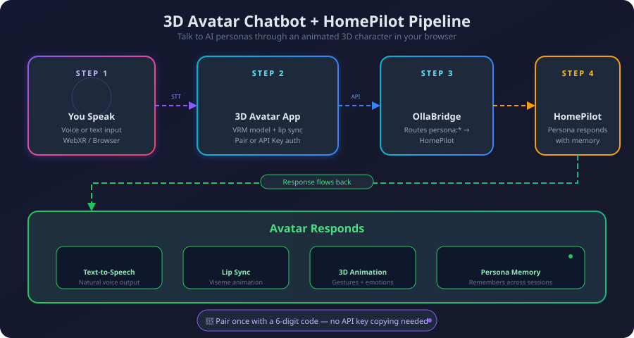
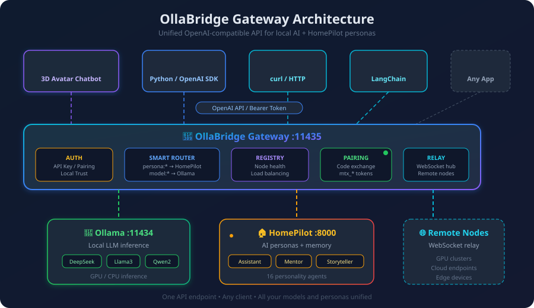
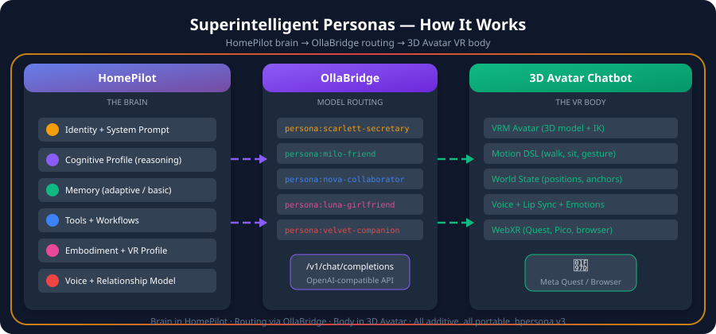

<div align="center">

<!-- Logo -->
<svg width="180" height="180" viewBox="0 0 200 200" xmlns="http://www.w3.org/2000/svg">
  <defs>
    <linearGradient id="logo-bg" x1="0%" y1="0%" x2="100%" y2="100%">
      <stop offset="0%" style="stop-color:#667eea;stop-opacity:1" />
      <stop offset="100%" style="stop-color:#764ba2;stop-opacity:1" />
    </linearGradient>
    <linearGradient id="logo-accent" x1="0%" y1="0%" x2="100%" y2="100%">
      <stop offset="0%" style="stop-color:#10b981;stop-opacity:1" />
      <stop offset="100%" style="stop-color:#059669;stop-opacity:1" />
    </linearGradient>
    <filter id="logo-glow">
      <feDropShadow dx="0" dy="2" stdDeviation="4" flood-color="#667eea" flood-opacity="0.35"/>
    </filter>
  </defs>

  <!-- Outer rings -->
  <circle cx="100" cy="100" r="95" fill="url(#logo-bg)" opacity="0.08"/>
  <circle cx="100" cy="100" r="85" fill="url(#logo-bg)" opacity="0.15"/>

  <!-- Robot head -->
  <g filter="url(#logo-glow)">
    <rect x="65" y="60" width="70" height="65" rx="12" fill="url(#logo-bg)"/>
  </g>

  <!-- Antenna -->
  <line x1="100" y1="60" x2="100" y2="40" stroke="#667eea" stroke-width="3" stroke-linecap="round"/>
  <circle cx="100" cy="35" r="6" fill="#10b981">
    <animate attributeName="opacity" values="1;0.4;1" dur="2s" repeatCount="indefinite"/>
  </circle>

  <!-- Eyes -->
  <circle cx="80" cy="85" r="8" fill="white"/>
  <circle cx="120" cy="85" r="8" fill="white"/>
  <circle cx="82" cy="85" r="4" fill="#667eea">
    <animate attributeName="cx" values="82;84;82;80;82" dur="4s" repeatCount="indefinite"/>
  </circle>
  <circle cx="122" cy="85" r="4" fill="#667eea">
    <animate attributeName="cx" values="122;124;122;120;122" dur="4s" repeatCount="indefinite"/>
  </circle>

  <!-- Mouth -->
  <path d="M 75 105 Q 100 115 125 105" stroke="white" stroke-width="3" fill="none" stroke-linecap="round"/>

  <!-- Speech bubble -->
  <circle cx="150" cy="68" r="22" fill="url(#logo-accent)" opacity="0.9"/>
  <path d="M 140 82 L 135 92 L 150 82" fill="url(#logo-accent)" opacity="0.9"/>
  <text x="150" y="75" font-family="Arial" font-size="18" fill="white" text-anchor="middle" font-weight="bold">AI</text>

  <!-- VR headset hint -->
  <rect x="62" y="77" width="76" height="18" rx="9" fill="none" stroke="rgba(255,255,255,0.25)" stroke-width="1.5"/>
</svg>

# 3D Avatar Chatbot

**AI-powered conversational platform with 3D avatars, voice interaction, and
WebXR immersion**

[](https://github.com/ruslanmv/3D-Avatar-Chatbot/releases)
[](LICENSE)
[](https://nodejs.org/)
[](https://github.com/ruslanmv/3D-Avatar-Chatbot/actions)

[Live Demo](https://ruslanmv.github.io/3D-Avatar-Chatbot/) &middot;
[Deploy to Vercel](https://vercel.com/new/clone?repository-url=https://github.com/ruslanmv/3D-Avatar-Chatbot)
&middot; [Report Issue](https://github.com/ruslanmv/3D-Avatar-Chatbot/issues)

</div>

---

## Overview

A production-ready web application that combines interactive 3D avatars with
multi-provider AI chat, real-time voice I/O, and full VR/AR support. No
framework dependencies — runs on vanilla JavaScript, Three.js, and WebXR.

**Key capabilities:**

- **Multi-AI providers** — OpenAI, Claude, IBM Watsonx, Ollama, OllaBridge
  (HomePilot personas)
- **3D avatar engine** — 30+ GLB/VRM models with morph-target lip sync,
  emotions, gaze tracking
- **Voice interaction** — Speech-to-text and text-to-speech with device/language
  selection
- **WebXR immersion** — VR mode (Quest 2/3, Pico) and AR mode (hit-test surface
  placement)
- **Passthrough AR** — See your real room with the avatar standing in it
  (contact shadows, light estimation, depth occlusion on Quest 3)
- **Pose Studio** — Interactive bone-level pose editing with presets, save/load,
  undo/redo, and mirroring
- **Face Tracking** — Webcam-based expression mirroring via MediaPipe (blinks,
  gaze, mouth, emotions) with smooth camera zoom to face
- **Mobile-first** — Enterprise mobile layout with drawer navigation, responsive
  panels, and AR access
- **Privacy-first** — API keys stored in browser localStorage, zero server-side
  data collection

---

## Quick Start

### One-click deploy

[](https://vercel.com/new/clone?repository-url=https://github.com/ruslanmv/3D-Avatar-Chatbot)

### Local development

```bash
git clone https://github.com/ruslanmv/3D-Avatar-Chatbot.git
cd 3D-Avatar-Chatbot
npm install
npm run dev          # http://localhost:8080
```

### Run tests

```bash
make test            # Avatar health check + unit tests
make test-avatars    # Avatar file validation only
npm run validate     # Lint + format + tests
```

---

## Configuration

Open **Settings** in the app and select your AI provider:

| Provider         | API Key Format   | Get Key                                                                                                                                                                     |
| ---------------- | ---------------- | --------------------------------------------------------------------------------------------------------------------------------------------------------------------------- |
| OpenAI           | `sk-proj-...`    | [platform.openai.com](https://platform.openai.com/api-keys)                                                                                                                 |
| Claude           | `sk-ant-...`     | [console.anthropic.com](https://console.anthropic.com/settings/keys)                                                                                                        |
| Watsonx          | IAM key          | [cloud.ibm.com](https://cloud.ibm.com)                                                                                                                                      |
| Ollama           | None (local)     | [ollama.ai](https://ollama.ai)                                                                                                                                              |
| OllaBridge       | `sk-ollabridge-` | [github.com/ruslanmv/ollabridge](https://github.com/ruslanmv/ollabridge)                                                                                                    |
| OllaBridge Cloud | Device token     | [github.com/ruslanmv/ollabridge-cloud](https://github.com/ruslanmv/ollabridge-cloud) — pair your PC once, then point the Avatar to the Cloud URL; no port forwarding needed |

Click **Fetch Models** after entering your key to discover available models.
Keys are validated automatically before saving.

---

## Architecture

```
Browser
├── UI Layer
│   ├── 3D Avatar Viewport (Three.js + WebGL)
│   ├── Chat Panel
│   ├── Voice Controls (Web Speech API)
│   └── VR/AR Mode (WebXR)
│
├── Manager Layer
│   ├── ViewerEngine ─── AvatarManager, PostProcessing, PerformanceMonitor
│   ├── LLMManager ───── OpenAI / Claude / Watsonx / Ollama / OllaBridge
│   ├── SpeechService ── STT + TTS with device selection
│   └── VR System ────── VRControllers, VRChatPanel, VRChatIntegration, ARSupport
│
└── Proxy Layer
    └── nexus-proxy (Express CORS proxy for API requests)
```

### Core modules

| Module              | Location                                 | Purpose                                   |
| ------------------- | ---------------------------------------- | ----------------------------------------- |
| ViewerEngine        | `src/gltf-viewer/ViewerEngine.js`        | 3D scene, camera, lighting, XR            |
| AvatarManager       | `src/gltf-viewer/AvatarManager.js`       | Model loading, animation mixer            |
| LLMManager          | `src/LLMManager.js`                      | Multi-provider AI orchestration           |
| VRSupport           | `src/gltf-viewer/VRSupport.js`           | WebXR VR session management               |
| ARSupport           | `src/gltf-viewer/ARSupport.js`           | WebXR AR with hit-test placement          |
| PassthroughEnhancer | `src/gltf-viewer/PassthroughEnhancer.js` | AR passthrough grounding and lighting     |
| VRControllers       | `src/gltf-viewer/VRControllers.js`       | 6DOF input, locomotion, grab-spin         |
| VRChatPanel         | `src/gltf-viewer/VRChatPanel.js`         | 3D canvas UI for VR chat                  |
| VRChatIntegration   | `src/gltf-viewer/VRChatIntegration.js`   | Wires VR chat + speech + AI               |
| ModelViewerAR       | `src/gltf-viewer/ModelViewerAR.js`       | Cross-platform AR fallbacks               |
| MobileSupport       | `src/gltf-viewer/MobileSupport.js`       | Device detection, perf tuning             |
| PoseEditor          | `src/PoseEditor.js`                      | Pose Studio orchestrator (undo/redo)      |
| PoseStudioPanel     | `src/PoseStudioPanel.js`                 | Pose Studio UI (bone selectors, controls) |
| MobileDrawerWiring  | `src/MobileDrawerWiring.js`              | Mobile drawer navigation wiring           |
| FaceTracker         | `src/FaceTracker.js`                     | Webcam face tracking via MediaPipe        |
| CameraPresets       | `src/gltf-viewer/CameraPresets.js`       | Smooth camera zoom transitions            |
| SpeechService       | `js/speech-service.js`                   | STT/TTS with mic/voice selection          |
| main.js             | `src/main.js`                            | App init, settings, UI wiring             |

---

## VR / AR Support

### VR Mode (Quest 2/3, Pico, any WebXR headset)

1. Open the app in **Meta Quest Browser** (HTTPS or localhost required)
2. Click **Enter VR** in the avatar footer
3. Controls (industry-standard Meta Quest mapping):
    - **Left stick** — walk/strafe
    - **Right stick** — snap turn / fly up-down
    - **Grip (squeeze)** — grab & spin avatar / drag panel
    - **Trigger** — select / click UI
    - **X / A button** — toggle chat panel
    - **Y / B button** — push-to-talk (hold to record)

### Passthrough Mode (Quest 3)

See your real room with the avatar standing in it:

1. Enter VR mode on Quest 3
2. Open the chat panel (X button) → cycle BG to **PASS**
3. The headset camera feed appears as background with the avatar grounded via
   contact shadows

Features: real-world light estimation, contact shadow under avatar feet, depth
occlusion (real objects appear in front of virtual ones on Quest 3).

### AR Mode

- **Mobile** — Uses native AR (iOS Quick Look, Android Scene Viewer) or WebXR AR
  via the mobile drawer
- **Headset** — WebXR hit-test for surface placement with shadow plane
- **Desktop** — QR code to launch AR on your phone

### Pose Studio

Interactive pose editing for humanoid avatars:

1. Click the **Pose Studio** button in the avatar footer (or mobile drawer)
2. Select a bone (head, arms, hands, spine, legs)
3. Rotate on X/Y/Z axes, apply presets, mirror arm poses
4. Save/load custom poses, undo/redo up to 50 steps

See [docs/vr-setup.md](docs/vr-setup.md) for detailed VR/AR documentation.

---

## Compatible with HomePilot

<div align="center">

<a href="https://github.com/ruslanmv/HomePilot">
  
</a>

Talk to [**HomePilot**](https://github.com/ruslanmv/HomePilot) AI personas
through your 3D avatar. Connect via
[**OllaBridge**](https://github.com/ruslanmv/ollabridge) gateway with API key or
device pairing.

</div>

### How it works

<div align="center">
  
</div>

The **OllaBridge** gateway routes your avatar's chat requests to HomePilot's
persona system. Each persona brings its own personality, long-term memory, and
MCP tool capabilities — all through the familiar OpenAI-compatible API.

<div align="center">
  
</div>

### Quick setup

```bash
# 1. Start HomePilot backend
cd HomePilot && make install && make run    # :8000

# 2. Start OllaBridge gateway
ollabridge start --auth-mode pairing        # :11435

# 3. Open 3D Avatar Chatbot → Settings → select OllaBridge → enter pairing code → Fetch Models
```

Select a persona model like `persona:my-therapist` or `personality:storyteller`
to chat with persistent AI personalities.

### Available personas

HomePilot ships with **16 built-in personalities** plus unlimited custom
personas:

| Persona                      | Description                                                                        |
| ---------------------------- | ---------------------------------------------------------------------------------- |
| `personality:assistant`      | Proactive home AI                                                                  |
| `personality:therapist`      | Empathetic wellness companion                                                      |
| `personality:storyteller`    | Narrative-driven storyteller                                                       |
| `personality:motivation`     | Encouraging coach                                                                  |
| `personality:kids-trivia`    | Educational trivia for children                                                    |
| `persona:<your-project>`     | Any custom persona you create                                                      |
| `persona:scarlett-secretary` | Superintelligent executive secretary with orchestrated workflows and VR embodiment |
| `persona:milo-friend`        | Superintelligent best friend with adaptive memory and spatial presence             |
| `persona:nova-collaborator`  | Superintelligent work collaborator with multi-step planning                        |
| `persona:luna-girlfriend`    | Superintelligent companion with emotional continuity and hand interactions         |
| `persona:velvet-companion`   | Superintelligent adult companion with gated escalation and VR presence             |

<p align="center">
  
</p>

Superintelligent personas carry cognitive profiles, spatial awareness, VR
embodiment, and motion commands — the avatar walks, sits, follows, and gestures
based on what you say. See the
[HomePilot PERSONA docs](https://github.com/ruslanmv/HomePilot/blob/master/docs/PERSONA.md)
for the full specification.

<div align="center">

[](https://github.com/ruslanmv/HomePilot)
[](https://github.com/ruslanmv/ollabridge)

</div>

---

## Project Structure

```
3D-Avatar-Chatbot/
├── index.html              # Main application entry point
├── src/
│   ├── main.js             # App initialization and settings
│   ├── LLMManager.js       # Multi-provider AI manager
│   ├── PoseEditor.js       # Pose Studio orchestrator (undo/redo, bone selection)
│   ├── PoseStudioPanel.js  # Pose Studio UI panel
│   ├── PoseRigMap.js       # Unified humanoid bone mapping
│   ├── PoseState.js        # Skeleton pose capture/apply via delta quaternions
│   ├── PoseLibrary.js      # Built-in presets + localStorage persistence
│   ├── PoseApplier.js      # High-level bone manipulation and mirroring
│   ├── FaceTracker.js       # Webcam face tracking (MediaPipe)
│   ├── MobileDrawerWiring.js # Mobile drawer navigation wiring
│   └── gltf-viewer/        # 3D engine modules
│       ├── ViewerEngine.js
│       ├── CameraPresets.js
│       ├── AvatarManager.js
│       ├── VRSupport.js / ARSupport.js
│       ├── PassthroughEnhancer.js  # AR passthrough grounding + lighting
│       ├── VRControllers.js
│       ├── VRChatPanel.js / VRChatIntegration.js
│       ├── VRMediaPanel.js
│       ├── ModelViewerAR.js
│       ├── MobileSupport.js
│       ├── PostProcessing.js
│       └── PerformanceMonitor.js
├── js/                     # Legacy modules (chat, speech, avatar controller)
├── styles/                 # CSS
├── vendor/
│   ├── three-0.147.0/      # Three.js (vendored)
│   └── avatars/            # GLB/VRM avatar models + avatars.json manifest
├── api/                    # Vercel serverless functions (CORS proxy)
├── nexus-proxy/            # Express CORS proxy server
├── tests/                  # Jest test suite
├── docs/                   # Documentation
├── check-avatars.py        # Avatar health check & test suite
├── Makefile                # Development commands
├── vercel.json             # Vercel deployment config
└── package.json
```

---

## Development

```bash
make dev             # Start dev server
make test            # Run all tests (avatar health + Jest)
make test-avatars    # Validate avatar model files
make format          # Format with Prettier
make lint            # Lint with ESLint
make validate        # Lint + format check + tests (CI)
make help            # Show all commands
```

### Avatar health check

The `check-avatars.py` script validates all avatar model files:

```bash
python3 check-avatars.py          # Detailed report
python3 check-avatars.py --test   # CI mode (87 tests)
```

Checks performed:

- GLB/VRM binary header validation (magic number, version, file size)
- Manifest consistency (`avatars.json` entries match files on disk)
- Orphan detection (files not listed in manifest)
- Vercel config validation (Content-Type headers, CORS, routing)

---

## Deployment

### Vercel (recommended)

Click the deploy button above, or:

```bash
npm install -g vercel
vercel --prod
```

### Other platforms

| Platform         | Method                                  |
| ---------------- | --------------------------------------- |
| GitHub Pages     | Enable in repository settings           |
| Netlify          | Connect GitHub repo or drag-drop folder |
| AWS S3           | Upload static files + CloudFront CDN    |
| Cloudflare Pages | Connect repository                      |

See [docs/deployment.md](docs/deployment.md) for detailed deployment guides.

---

## Troubleshooting

| Problem                          | Solution                                                   |
| -------------------------------- | ---------------------------------------------------------- |
| Models not loading after API key | Click **Fetch Models** button                              |
| 401 authentication error         | Run `window.debugAPIKeys()` in console                     |
| VR button not appearing          | Use HTTPS or localhost (WebXR requires secure context)     |
| Avatar not showing in VR         | Check console for GLTF load errors                         |
| Voice input not working          | Grant microphone permissions, select correct device        |
| Passthrough not working          | Requires Quest 3. Cycle BG to PASS in VR settings          |
| AR button disabled on mobile     | Use the mobile drawer menu (hamburger icon) → VR/AR        |
| Pose Studio bones not detected   | Works best with VRM models; GLB uses name-based heuristics |

---

## Contributing

```bash
git clone https://github.com/YOUR_USERNAME/3D-Avatar-Chatbot.git
cd 3D-Avatar-Chatbot
git checkout -b feature/your-feature
npm test && npm run lint:check
git commit -m "feat: your feature"
git push origin feature/your-feature
```

---

## License

[Apache License 2.0](LICENSE) — Copyright 2025
[Ruslan Magana](https://ruslanmv.com)

---

<div align="center">

**[ruslanmv.com](https://ruslanmv.com)** &middot;
[GitHub](https://github.com/ruslanmv) &middot;
[Report Bug](https://github.com/ruslanmv/3D-Avatar-Chatbot/issues) &middot;
[Request Feature](https://github.com/ruslanmv/3D-Avatar-Chatbot/issues)

</div>
