<div align="center">


# 3D Avatar Chatbot

**A 3D companion you can talk to, take into VR, and dress up — in the browser,
with no build step**

[](https://github.com/ruslanmv/3D-Avatar-Chatbot/releases)
[](LICENSE)
[](https://nodejs.org/)
[](https://github.com/ruslanmv/3D-Avatar-Chatbot/actions)

[Live Demo](https://ruslanmv.github.io/3D-Avatar-Chatbot/) &middot;
[Wardrobe Forge on Hugging Face](https://huggingface.co/spaces/ruslanmv/3D-Wardrobe-Forge)
&middot;
[Deploy to Vercel](https://vercel.com/new/clone?repository-url=https://github.com/ruslanmv/3D-Avatar-Chatbot)
&middot; [Report Issue](https://github.com/ruslanmv/3D-Avatar-Chatbot/issues)

</div>

---

## Overview

A web application that puts a VRM character in your browser and lets you talk to
her: multi-provider AI chat, voice in and out, VR and AR, and a wardrobe she can
change on request. Vanilla JavaScript, Three.js r147 and WebXR, served as static
files by a small Node proxy — nothing is bundled or transpiled.

**Key capabilities:**

- **Multi-AI providers** — OpenAI, Claude, IBM Watsonx, Ollama, OllaBridge
  (HomePilot personas)
- **3D avatar engine** — bundled VRM/GLB characters plus an Avatar Library
  (including VRoid Hub), with lip sync, emotions and gaze tracking
- **Wardrobe & Try-On Haul** — new outfits on the character, from a verified
  pack that needs no server or made on demand by the
  [3D Wardrobe Forge](https://huggingface.co/spaces/ruslanmv/3D-Wardrobe-Forge)
  on Hugging Face; ask her in the chat and she changes —
  [see below](#wardrobe--try-on-haul)
- **Scenic ambience** — ten generated scenes composed for this app's camera
- **Voice interaction** — Speech-to-text and text-to-speech with device/language
  selection. Two TTS engines: your device's built-in voices, or Piper (offline
  neural, identical on every device). If a language has no voice on your phone,
  Settings ▸ SPEECH explains how to install one — see
  [docs/VOICES.md](docs/VOICES.md)
- **WebXR immersion** — VR mode (Quest 2/3, Pico) and AR mode (hit-test surface
  placement)
- **Passthrough AR** — See your real room with the avatar standing in it
  (contact shadows, light estimation, depth occlusion on Quest 3)
- **Pose Studio** — Interactive bone-level pose editing with presets, save/load,
  undo/redo, and mirroring
- **Face Tracking** — Webcam-based expression mirroring via MediaPipe (blinks,
  gaze, mouth, emotions) with smooth camera zoom to face
- **Mobile-first** — Enterprise mobile layout with drawer navigation, responsive
  panels, and AR access
- **Privacy-first** — API keys stay in your browser's localStorage; the proxy
  forwards requests and stores nothing

### Behavior Director

An animation and companion engine that decides what she does, in three tiers:
reflexes every frame, a semantic clip selector under 50 ms, and — when paired
with [HomePilot](https://github.com/ruslanmv/HomePilot) — turn-level
orchestration. It ships **on**, so the launcher is there on a fresh install;
**Settings ▸ Behavior Director** is the kill switch, and turning it off means
nothing under `src/behavior/` is fetched at all. Tune it in
`config/behavior.config.json`.

A **two-person button** in the avatar toolbar is the one entry point to every
experience below. Nothing else in the toolbar moves.

**Most of it needs no server.** Focus, Journey, Music, Watch and Coach run
entirely in the browser. Only _Help me with this_ and _Meeting_ need HomePilot —
they ask a model about a picture — and when it is not linked they say so and
point at Settings rather than starting and going quiet. See
[docs/ENABLING.md](docs/ENABLING.md).

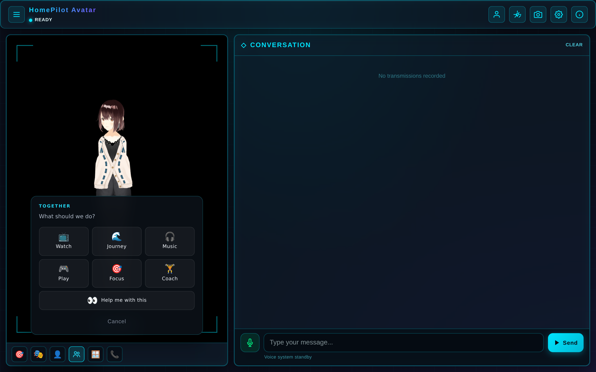

- **Together Mode** — watch a film, listen to music, or sit in a guided scene
  with her. Her silence is the feature: she comments only at openings. On a
  phone the sheet reserves the composer's strip so its buttons stay tappable
  ([docs/TOGETHER_MOBILE_LAYOUT.md](docs/TOGETHER_MOBILE_LAYOUT.md))
- **Body doubling** — 25/5 focus blocks with a quiet profile and streaks stored
  in her long-term memory. Zero spoken lines inside a block, enforced by the
  same gate that runs everything else
- **Hands-busy copilot & coach** — a checklist and timers by voice while your
  hands are covered in dough, and rep counting from the camera. **On-demand
  snapshots only** — there is no periodic-frame code path, and the privacy audit
  checks that by reading source
- **Clips & share cards** — a rolling 30-second buffer, one tap to save. Nothing
  under `src/features/clips/` can reach the network, and a static check holds
  that for files nobody has written yet
- **Consent-first capture** — one file may open a camera or a screen, the
  indicator shows in 2D _and_ in XR, and revoking cancels in-flight sampling
  within a frame

Four gates run in CI and are all green: the engine is provably inert with the
flag off, eight privacy claims hold as properties of the source, the frame and
pick budgets sit inside 25% headroom, and the knowledge base regenerates itself
byte for byte.

Setup, browser requirements and a per-feature test recipe:
**[docs/ENABLING.md](docs/ENABLING.md)**.

---

## Quick Start

### One-click deploy

[](https://vercel.com/new/clone?repository-url=https://github.com/ruslanmv/3D-Avatar-Chatbot)

### Local development

```bash
git clone https://github.com/ruslanmv/3D-Avatar-Chatbot.git
cd 3D-Avatar-Chatbot
npm ci               # Node 24 (see .node-version)
npm start            # http://localhost:8080 (next free port if busy)
```

### Run tests

```bash
npm run validate     # Lint + format check + the Jest suite — what CI runs
make test            # Avatar health check + unit tests
make test-avatars    # Avatar file validation only
npm run wardrobe:check   # Re-hash the shipped wardrobe pack

# Behavior Director gates — the four CI runs
node scripts/behavior-parity-baseline.mjs --check   # inert with the flag off
node scripts/audit-privacy.mjs --check              # eight privacy claims
node scripts/audit-budgets.mjs --check              # frame / pick / clip / pose cost
node kb/scripts/validate-manifest.mjs --level semantic
```

---

## Companion Mode

Pop the live avatar out into a small floating window and keep it beside you
while you work — talk to it hands-free, or type.

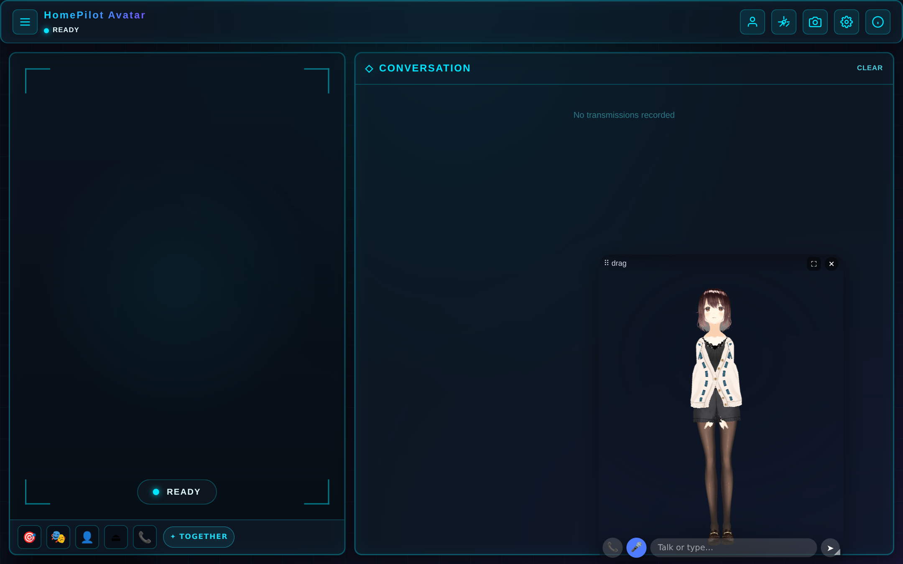

_Above: the in-page window, which is what you get on Firefox, Safari and mobile.
On a browser with Document Picture-in-Picture (Chrome, Edge) the same button
pops the avatar into a real OS window you can park outside the browser — same
controls, same canvas, no second copy of the avatar._

**How to use**

1. Click **🪟** in the avatar toolbar to float it, or **📞** to start a
   hands-free call. (Desktop shortcut: `Alt + C`. Deep links: `?mode=companion`,
   `?mode=call`. On mobile: **☰ menu ▸ Companion**.)
2. **Talk or type** in the window: **📞** starts/ends the call, **🎤** is
   push-to-talk (mute/unmute during a call), and replies are spoken aloud with
   subtitles.
3. **Drag** it by its handle, **resize** from the **◢** corner, **⛶** expands
   it, **✕** brings the avatar back into the page.
4. Optional **wake word** — enable it in **Settings ▸ Overlay**, then just say
   **"Nexus"** to start talking; it returns to standby after ~20 s of silence.

Everything is additive: closing the companion restores the page exactly as it
was. Full details in [docs/COMPANION-MODE.md](docs/COMPANION-MODE.md).

> **Want it transparent over your desktop?** Browsers can't make a window
> see-through to the OS, so use the Electron shell in
> [`desktop-shell/`](desktop-shell/) (`npm install && npm start`) — it loads the
> same app frameless, always-on-top and click-through.

---

## Scenic Ambience

Ten places to be together, each generated for this app's camera so she stands on
the ground rather than in front of a photograph. Pick one yourself in **Settings
▸ Scenes**, or let her change it when the conversation fits.


_Above: the ten built-in scenes. Every one has a continuous, readable standing
surface across its lower third — that is the part a landscape photograph almost
never has, and the reason these were generated rather than sourced._

**Two compositions per scene, not one picture cropped twice**

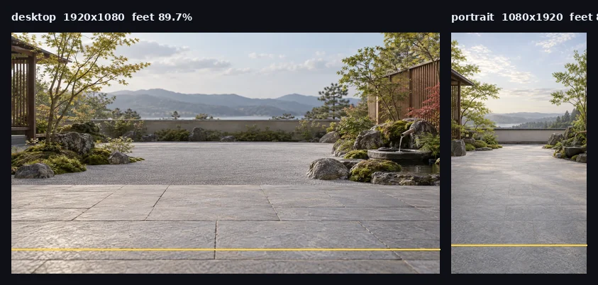

A scene is composed for a projection, not for a device. This app's camera is
tilted about 1.72° down, which puts the horizon at **44.4%** of frame height in
landscape and **46.1%** in portrait, and her feet at **89.7%** and **88.2%**.
Cropping one picture to serve both shapes moves the horizon; generating two does
not. The runtime picks between them by the shape of the canvas, and reloads
rather than re-crops when you rotate the device.

**Optional: keep the ground under her feet**

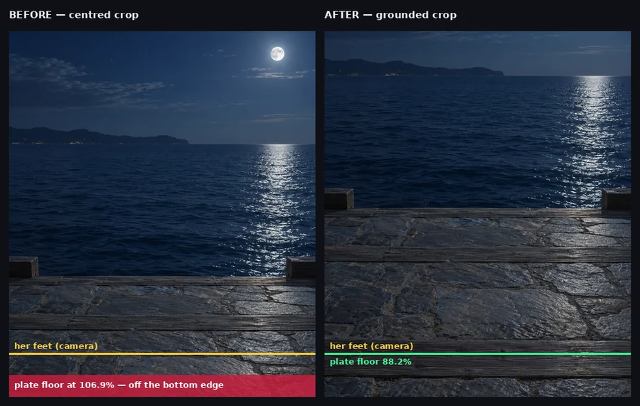

Those two numbers are exact only at the shape each plate was composed for. In
any other shape the centred crop trims equally from both ends and the floor
drifts. **Settings ▸ Scenes ▸ Keep the ground under her feet** anchors the crop
to the row the camera stands her on instead — the ground stays put, at the cost
of a composition that is no longer centred. It is **off by default**: centred is
what these scenes were art-directed against.

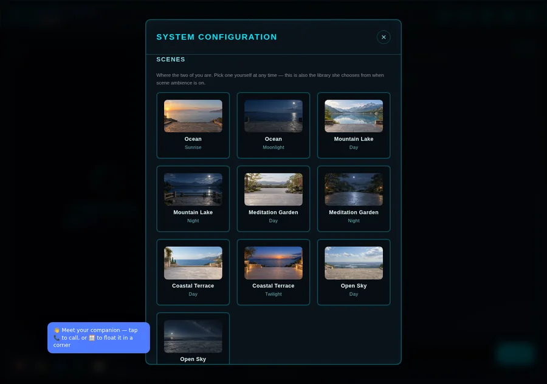

The art is produced by
[3D-Ambience-Studio](https://github.com/ruslanmv/3D-Ambience-Studio), which owns
generation, validation and packaging; this app only ever consumes finished
packages. See [`assets/ambient/PROVENANCE.md`](assets/ambient/PROVENANCE.md) for
the model, the sizes and the licence.

---

## Configuration

Open **Settings** in the app and select your AI provider:

| Provider         | API Key Format   | Get Key                                                                                                                                                                     |
| ---------------- | ---------------- | --------------------------------------------------------------------------------------------------------------------------------------------------------------------------- |
| OpenAI           | `sk-proj-...`    | [platform.openai.com](https://platform.openai.com/api-keys)                                                                                                                 |
| Claude           | `sk-ant-...`     | [console.anthropic.com](https://console.anthropic.com/settings/keys)                                                                                                        |
| Watsonx          | IAM key          | [cloud.ibm.com](https://cloud.ibm.com)                                                                                                                                      |
| Ollama           | None (local)     | [ollama.ai](https://ollama.ai)                                                                                                                                              |
| OllaBridge       | `sk-ollabridge-` | [github.com/ruslanmv/ollabridge](https://github.com/ruslanmv/ollabridge)                                                                                                    |
| OllaBridge Cloud | Device token     | [github.com/ruslanmv/ollabridge-cloud](https://github.com/ruslanmv/ollabridge-cloud) — pair your PC once, then point the Avatar to the Cloud URL; no port forwarding needed |

Click **Fetch Models** after entering your key to discover available models.
Keys are validated automatically before saving.

---

## Architecture

```
Browser
├── UI Layer
│   ├── 3D Avatar Viewport (Three.js + WebGL)
│   ├── Chat Panel
│   ├── Voice Controls (Web Speech API)
│   └── VR/AR Mode (WebXR)
│
├── Manager Layer
│   ├── ViewerEngine ─── AvatarManager, PostProcessing, PerformanceMonitor
│   ├── LLMManager ───── OpenAI / Claude / Watsonx / Ollama / OllaBridge
│   ├── SpeechService ── STT + TTS with device selection
│   └── VR System ────── VRControllers, VRChatPanel, VRChatIntegration, ARSupport
│
└── Proxy Layer
    └── nexus-proxy (Express CORS proxy for API requests)
```

### Core modules

| Module              | Location                                 | Purpose                                   |
| ------------------- | ---------------------------------------- | ----------------------------------------- |
| ViewerEngine        | `src/gltf-viewer/ViewerEngine.js`        | 3D scene, camera, lighting, XR            |
| AvatarManager       | `src/gltf-viewer/AvatarManager.js`       | Model loading, animation mixer            |
| LLMManager          | `src/LLMManager.js`                      | Multi-provider AI orchestration           |
| VRSupport           | `src/gltf-viewer/VRSupport.js`           | WebXR VR session management               |
| ARSupport           | `src/gltf-viewer/ARSupport.js`           | WebXR AR with hit-test placement          |
| PassthroughEnhancer | `src/gltf-viewer/PassthroughEnhancer.js` | AR passthrough grounding and lighting     |
| VRControllers       | `src/gltf-viewer/VRControllers.js`       | 6DOF input, locomotion, grab-spin         |
| VRChatPanel         | `src/gltf-viewer/VRChatPanel.js`         | 3D canvas UI for VR chat                  |
| VRChatIntegration   | `src/gltf-viewer/VRChatIntegration.js`   | Wires VR chat + speech + AI               |
| ModelViewerAR       | `src/gltf-viewer/ModelViewerAR.js`       | Cross-platform AR fallbacks               |
| MobileSupport       | `src/gltf-viewer/MobileSupport.js`       | Device detection, perf tuning             |
| PoseEditor          | `src/PoseEditor.js`                      | Pose Studio orchestrator (undo/redo)      |
| PoseStudioPanel     | `src/PoseStudioPanel.js`                 | Pose Studio UI (bone selectors, controls) |
| MobileDrawerWiring  | `src/MobileDrawerWiring.js`              | Mobile drawer navigation wiring           |
| FaceTracker         | `src/FaceTracker.js`                     | Webcam face tracking via MediaPipe        |
| CameraPresets       | `src/gltf-viewer/CameraPresets.js`       | Smooth camera zoom transitions            |
| SpeechService       | `js/speech-service.js`                   | STT/TTS with mic/voice selection          |
| main.js             | `src/main.js`                            | App init, settings, UI wiring             |

---

## VR / AR Support

### VR Mode (Quest 2/3, Pico, any WebXR headset)

1. Open the app in **Meta Quest Browser** (HTTPS or localhost required)
2. Click **Enter VR** in the avatar footer
3. Controls (industry-standard Meta Quest mapping):
    - **Left stick** — walk/strafe
    - **Right stick** — snap turn / fly up-down
    - **Grip (squeeze)** — grab & spin avatar / drag panel
    - **Trigger** — select / click UI
    - **X / A button** — toggle chat panel
    - **Y / B button** — push-to-talk (hold to record)

### Passthrough Mode (Quest 3)

See your real room with the avatar standing in it:

1. Enter VR mode on Quest 3
2. Open the chat panel (X button) → cycle BG to **PASS**
3. The headset camera feed appears as background with the avatar grounded via
   contact shadows

Features: real-world light estimation, contact shadow under avatar feet, depth
occlusion (real objects appear in front of virtual ones on Quest 3).

### AR Mode

- **Mobile** — Uses native AR (iOS Quick Look, Android Scene Viewer) or WebXR AR
  via the mobile drawer
- **Headset** — WebXR hit-test for surface placement with shadow plane
- **Desktop** — QR code to launch AR on your phone

### Pose Studio

Interactive pose editing for humanoid avatars:

1. Click the **Pose Studio** button in the avatar footer (or mobile drawer)
2. Select a bone (head, arms, hands, spine, legs)
3. Rotate on X/Y/Z axes, apply presets, mirror arm poses
4. Save/load custom poses, undo/redo up to 50 steps

See [docs/vr-setup.md](docs/vr-setup.md) for detailed VR/AR documentation.

---

## Compatible with HomePilot

<div align="center">

<a href="https://github.com/ruslanmv/HomePilot">
  
</a>

Talk to [**HomePilot**](https://github.com/ruslanmv/HomePilot) AI personas
through your 3D avatar. Connect via
[**OllaBridge**](https://github.com/ruslanmv/ollabridge) gateway with API key or
device pairing.

</div>

### How it works

<div align="center">
  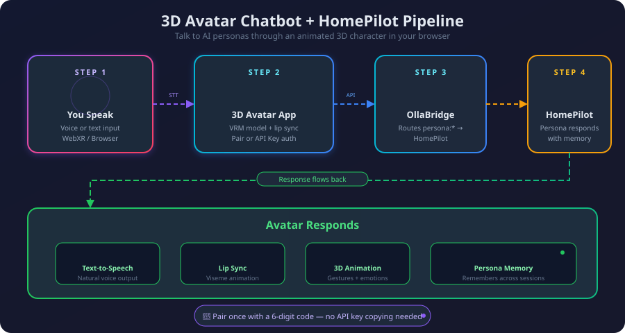
</div>

The **OllaBridge** gateway routes your avatar's chat requests to HomePilot's
persona system. Each persona brings its own personality, long-term memory, and
MCP tool capabilities — all through the familiar OpenAI-compatible API.

<div align="center">
  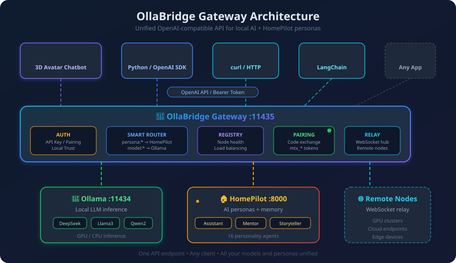
</div>

### Quick setup

```bash
# 1. Start HomePilot backend
cd HomePilot && make install && make run    # :8000

# 2. Start OllaBridge gateway
ollabridge start --auth-mode pairing        # :11435

# 3. Open 3D Avatar Chatbot → Settings → select OllaBridge → enter pairing code → Fetch Models
```

Select a persona model like `persona:my-therapist` or `personality:storyteller`
to chat with persistent AI personalities.

### Available personas

HomePilot ships with **16 built-in personalities** plus unlimited custom
personas:

| Persona                      | Description                                                                        |
| ---------------------------- | ---------------------------------------------------------------------------------- |
| `personality:assistant`      | Proactive home AI                                                                  |
| `personality:therapist`      | Empathetic wellness companion                                                      |
| `personality:storyteller`    | Narrative-driven storyteller                                                       |
| `personality:motivation`     | Encouraging coach                                                                  |
| `personality:kids-trivia`    | Educational trivia for children                                                    |
| `persona:<your-project>`     | Any custom persona you create                                                      |
| `persona:scarlett-secretary` | Superintelligent executive secretary with orchestrated workflows and VR embodiment |
| `persona:milo-friend`        | Superintelligent best friend with adaptive memory and spatial presence             |
| `persona:nova-collaborator`  | Superintelligent work collaborator with multi-step planning                        |
| `persona:luna-girlfriend`    | Superintelligent companion with emotional continuity and hand interactions         |
| `persona:velvet-companion`   | Superintelligent adult companion with gated escalation and VR presence             |

<p align="center">
  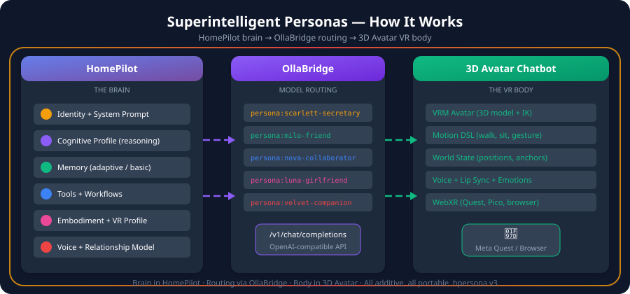
</p>

Superintelligent personas carry cognitive profiles, spatial awareness, VR
embodiment, and motion commands — the avatar walks, sits, follows, and gestures
based on what you say. See the
[HomePilot PERSONA docs](https://github.com/ruslanmv/HomePilot/blob/master/docs/PERSONA.md)
for the full specification.

<div align="center">

[](https://github.com/ruslanmv/HomePilot)
[](https://github.com/ruslanmv/ollabridge)

</div>

---

## Project Structure

```
3D-Avatar-Chatbot/
├── index.html              # Main application entry point
├── src/
│   ├── main.js             # App initialization and settings
│   ├── LLMManager.js       # Multi-provider AI manager
│   ├── PoseEditor.js       # Pose Studio orchestrator (undo/redo, bone selection)
│   ├── PoseStudioPanel.js  # Pose Studio UI panel
│   ├── PoseRigMap.js       # Unified humanoid bone mapping
│   ├── PoseState.js        # Skeleton pose capture/apply via delta quaternions
│   ├── PoseLibrary.js      # Built-in presets + localStorage persistence
│   ├── PoseApplier.js      # High-level bone manipulation and mirroring
│   ├── FaceTracker.js      # Webcam face tracking (MediaPipe)
│   ├── MobileDrawerWiring.js # Mobile drawer navigation wiring
│   ├── behavior/           # Behavior Director (loaded by behavior/boot.js)
│   ├── features/           # Together, ambience, chat, study… (IIFE modules)
│   ├── wardrobe/           # Wardrobe, Try-On Haul, Forge client, wardrobe tool
│   ├── avatar-library/     # Avatar Library helpers (VRoid Hub links)
│   └── gltf-viewer/        # 3D engine modules
│       ├── ViewerEngine.js
│       ├── CameraPresets.js
│       ├── AvatarManager.js
│       ├── VRSupport.js / ARSupport.js
│       ├── PassthroughEnhancer.js  # AR passthrough grounding + lighting
│       ├── VRControllers.js
│       ├── VRChatPanel.js / VRChatIntegration.js
│       ├── VRMediaPanel.js
│       ├── ModelViewerAR.js
│       ├── MobileSupport.js
│       ├── PostProcessing.js
│       └── PerformanceMonitor.js
├── js/                     # Legacy modules (chat, speech, avatar controller)
├── styles/                 # CSS
├── vendor/
│   ├── three-0.147.0/      # Three.js (vendored)
│   ├── avatars/            # GLB/VRM avatar models + avatars.json manifest
│   └── wardrobe/           # The verified outfit pack (ten looks, hashed)
├── assets/                 # Scenes, outfit dictionary, logos, screenshots
├── api/                    # Vercel serverless functions (CORS proxy)
├── nexus-proxy/            # Express CORS proxy server
├── tests/                  # Jest test suite
├── docs/                   # Documentation
├── check-avatars.py        # Avatar health check & test suite
├── Makefile                # Development commands
├── vercel.json             # Vercel deployment config
└── package.json
```

---

## Development

```bash
make dev             # Start dev server
make test            # Run all tests (avatar health + Jest)
make test-avatars    # Validate avatar model files
make format          # Format with Prettier
make lint            # Lint with ESLint
make validate        # Lint + format check + tests (CI)
make help            # Show all commands
```

### Avatar health check

The `check-avatars.py` script validates all avatar model files:

```bash
python3 check-avatars.py          # Detailed report
python3 check-avatars.py --test   # CI mode
```

Checks performed:

- GLB/VRM binary header validation (magic number, version, file size)
- Manifest consistency (`avatars.json` entries match files on disk)
- Orphan detection (files not listed in manifest)
- Vercel config validation (Content-Type headers, CORS, routing)

---

## Deployment

### Vercel (recommended)

Click the deploy button above, or:

```bash
npm install -g vercel
vercel --prod
```

### Other platforms

| Platform         | Method                                  |
| ---------------- | --------------------------------------- |
| GitHub Pages     | Enable in repository settings           |
| Netlify          | Connect GitHub repo or drag-drop folder |
| AWS S3           | Upload static files + CloudFront CDN    |
| Cloudflare Pages | Connect repository                      |

See [docs/deployment.md](docs/deployment.md) for detailed deployment guides.

---

## Troubleshooting

| Problem                          | Solution                                                   |
| -------------------------------- | ---------------------------------------------------------- |
| Models not loading after API key | Click **Fetch Models** button                              |
| 401 authentication error         | Run `window.debugAPIKeys()` in console                     |
| VR button not appearing          | Use HTTPS or localhost (WebXR requires secure context)     |
| Avatar not showing in VR         | Check console for GLTF load errors                         |
| Voice input not working          | Grant microphone permissions, select correct device        |
| Passthrough not working          | Requires Quest 3. Cycle BG to PASS in VR settings          |
| AR button disabled on mobile     | Use the mobile drawer menu (hamburger icon) → VR/AR        |
| Pose Studio bones not detected   | Works best with VRM models; GLB uses name-based heuristics |

---

## Contributing

```bash
git clone https://github.com/YOUR_USERNAME/3D-Avatar-Chatbot.git
cd 3D-Avatar-Chatbot
git checkout -b feature/your-feature
npm run format && npm run validate
git commit -m "feat: your feature"
git push origin feature/your-feature
```

---

## Wardrobe & Try-On Haul

She can change clothes. Open **Together ▸ Try-On**, tap a look and she is
wearing it; type "make it red" or "try the evening gown" and the outfit is
changed for her; or just ask in the chat, and she puts it on herself.

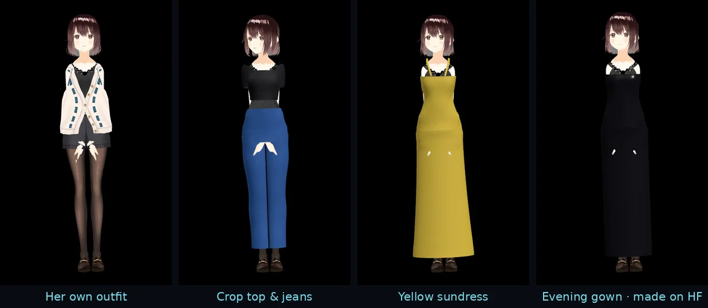

_Above: one session in the real app. The first three outfits come from the pack
this repository ships; the evening gown was made for her by the Wardrobe Forge
on Hugging Face while the page waited, and loaded straight from the Space._

**Where outfits come from**

| Source                                                                             | Needs                   | What it gives                                                                                        |
| ---------------------------------------------------------------------------------- | ----------------------- | ---------------------------------------------------------------------------------------------------- |
| `vendor/wardrobe/`                                                                 | nothing — works offline | ten looks, two per bundled avatar, every file SHA-256 verified before it is worn                     |
| [3D Wardrobe Forge](https://huggingface.co/spaces/ruslanmv/3D-Wardrobe-Forge) (HF) | the default; no setup   | new looks on demand, a 42-set outfit dictionary, and "change only the top" edits of the current look |
| Your own Forge, or a pack you import                                               | Settings / a `.zip`     | the same, from your server or your files                                                             |

A look is a VRM file: wearing one goes through the same loader as choosing an
avatar, after a snapshot of what she had on, so **End haul** always puts her
back exactly as she was.

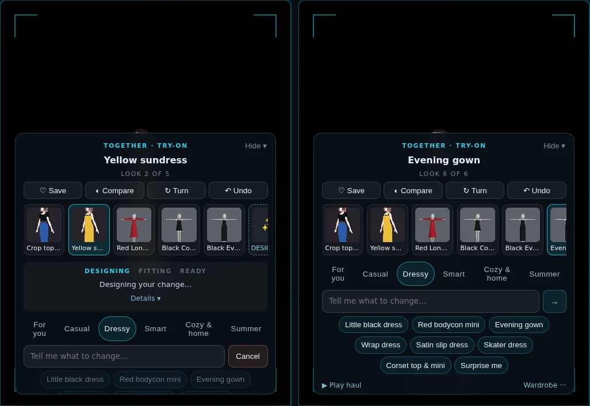

**She hosts it, YouTube try-on-haul style.** With a chat model configured, the
haul is a conversation: she opens it, reacts to each new look with one concrete
detail and a rating or "keep or return?", turns to show the back every few
looks, and recaps her favourites at the end. Those lines are ordinary replies —
in the chat history, saved and spoken. Without a model the haul works the same,
silently. Her wardrobe is also a tool she can use: she knows the outfit
dictionary, and a request like _"put on the little black dress"_ becomes a
`<wardrobe>` tag that the app runs once and never shows
([docs/WARDROBE_TOOL.md](docs/WARDROBE_TOOL.md)).

**Linked to Hugging Face by default — and checked.** Nothing to configure: the
Forge is
[`ruslanmv-3d-wardrobe-forge.hf.space`](https://ruslanmv-3d-wardrobe-forge.hf.space)
unless the site or the person says otherwise. **Settings ▸ Wardrobe Forge**
shows the connection and lets you choose your own endpoint, or none.

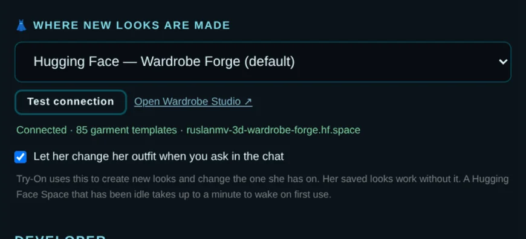

Verified on 2026-10-03 in the real app against the live Space, by recording
every request the page made to it:

```text
GET  /v1/capabilities                              Settings: "Connected · 85 garment templates"
GET  /v1/library, /v1/wardrobes/avatar-sample-a    her avatar matched to the Space's library
POST /v1/library/avatar-sample-a/jobs              "Evening gown" from the dictionary
GET  /v1/jobs/job_…                                designing → fitting → ready in 24 s
GET  /v1/assets/looks/look_…/look.vrm              the file she is wearing in the picture above
```

A Space that has been idle takes up to a minute to wake on first use; Test
connection in Settings says when it cannot be reached, and the shipped looks
keep working either way.

**Private looks stay private.** Swimwear, lingerie and tattoos are offered only
when private mode is on _and_ the Forge's operator has declared the avatar an
adult — two separate questions with two separate owners — and the Forge checks
again on every job. They never enter the chat history.

More: [docs/WARDROBE.md](docs/WARDROBE.md) (the feature and its rules) ·
[docs/TRY_ON_TOGETHER.md](docs/TRY_ON_TOGETHER.md) (Try-On inside Together) ·
[docs/WARDROBE_IMPORT.md](docs/WARDROBE_IMPORT.md) (looks as files you can
share) · [docs/WARDROBE_TOOL.md](docs/WARDROBE_TOOL.md) (the dictionary and the
hosted haul) ·
[3D-Wardrobe-Forge](https://github.com/ruslanmv/3D-Wardrobe-Forge) (the
generator).

---

## License

[Apache License 2.0](LICENSE) — Copyright 2025
[Ruslan Magana](https://ruslanmv.com)

---

<div align="center">

**[ruslanmv.com](https://ruslanmv.com)** &middot;
[GitHub](https://github.com/ruslanmv) &middot;
[Report Bug](https://github.com/ruslanmv/3D-Avatar-Chatbot/issues) &middot;
[Request Feature](https://github.com/ruslanmv/3D-Avatar-Chatbot/issues)

</div>
