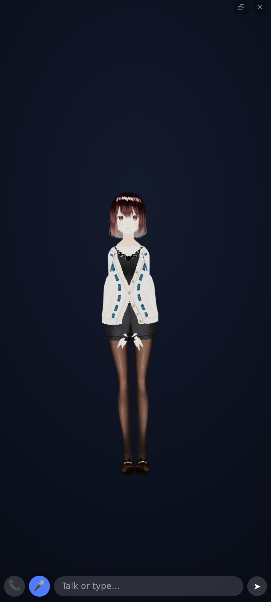

# Companion Mode — your 3D avatar in a corner while you work

An **additive, non-destructive** mode for
[ruslanmv/3D-Avatar-Chatbot](https://github.com/ruslanmv/3D-Avatar-Chatbot)
(yourfriend.online), inspired by desktop companions like _Your Mother_ on
Steam. Open the site, click one button, and the **live** 3D avatar pops out of
the page into a small **always-on-top** window that floats over VS Code, a
terminal, or anything else — on any monitor — so you can keep working with your
character right there beside you.

No install, no extension, no changes to how the app already behaves.

---

## Try it in 10 seconds

- **In the app:** tap **📞** to _call_ your companion (opens it and starts a
  hands-free voice chat in one tap), or **🪟** to float it in a corner. Both sit
  in the avatar toolbar (next to 🎯 🎭 👤). Desktop shortcut: **Alt + C**.
- **One-tap deep links:** `…/?mode=call` (opens + starts a live call) or
  `…/?mode=companion` (opens the floating window). Both start on your first
  tap/keypress (browsers require a user gesture for mic + PiP).
- **Standalone proof:** open `companion-demo.html` (serve locally, e.g.
  `npx serve` or `python3 -m http.server`) — it loads the real
  `src/CompanionMode.js` with a tiny stand-in character.

---

## Install it (Add to Home Screen)

The app is a **PWA**, so on mobile you can **Add to Home Screen** and launch the
companion full-screen like a native app — the "Google it → open on my phone"
flow. On Android/desktop Chrome you'll get an **Install** prompt; long-pressing
the installed icon exposes app **shortcuts**: **Call companion** (→ `?mode=call`)
and **Open companion window** (→ `?mode=companion`). Provided by
`manifest.webmanifest`, `assets/companion-*.png` and a minimal, cache-free
`sw.js` (it never caches the app, so nothing goes stale).

If no AI provider is configured yet, the companion shows a one-line hint
pointing to **Settings ▸ AI Provider**, so it never silently fails to reply.

---

## How it stays on top without Electron

Browsers cannot keep a normal tab above other applications — but
**Picture-in-Picture windows are always-on-top by design.** Companion Mode uses
that, with two strategies, best-first:

| Strategy | Browsers | What you get |
| --- | --- | --- |
| **Document Picture-in-Picture** | Chrome / Edge 116+ | The **real WebGL canvas** is moved into the floating window. Fully live and interactive — animation, lip-sync, orbit/zoom all keep working. |
| **Video PiP fallback** | Safari, Firefox\*, older Chromium | `canvas.captureStream()` mirrored into a PiP video — still always-on-top and live, just not clickable. |

\*Firefox exposes PiP through the video's context menu rather than a script call.

Chat, TTS and the AI providers keep running in the **main tab** — only the
_viewport_ moves. The avatar floats on a transparent background so it reads as a
character on your desktop, not a boxed scene.

---

## On mobile

Mobile is different from desktop for two hard reasons, so the design is
different too.

### Why the PiP bubble was black (and duplicated)

Document PiP does not exist on any mobile browser, so the only "float over other
apps" path is **video-PiP** (`canvas.captureStream()` → `<video>` →
`requestPictureInPicture()`). That has two intrinsic limits:

1. **It's a mirror, not a move.** The source canvas stays on the page, so you
   saw the avatar **twice** — big in the page, small in the bubble.
2. **The PiP surface is opaque.** Android/iOS composite the PiP video on a solid
   background — it **cannot be transparent**, so a transparent scene just reads
   as **black**. Showing the real phone home screen _behind_ a floating
   character is impossible from a browser; it needs a native app
   (Android `SYSTEM_ALERT_WINDOW`), which a web app can't request.

### What Companion Mode does now

**Default (best UX): an in-page transparent overlay.** Tapping **🪟** _moves_
(not mirrors) the avatar into a small, draggable, **transparent** widget that
floats over the app — so there's **no duplicate**, it shows **what's behind it**
instead of black, and it carries the **full voice + text chat**. Drag it by its
handle; **resize** it from the **◢** corner grip (160×220 up to nearly full
screen); **⛶** expands it to the fullscreen state below and **🗗** brings the
widget back; tap **✕** to close. Your chosen size and maximized state are
remembered (localStorage) and carried across page navigations.

### Fullscreen is a modal state, not a bigger widget



Tapping **⛶** switches the companion into a proper immersive surface rather than
just stretching the widget:

- **True edge-to-edge**, `100dvw × 100dvh` at `inset:0`. `dvh` specifically, so
  Android's collapsing URL bar can't leave a gap. The widget rule caps size at
  `97vw/92vh` and a `max-*` clamps `width`/`height` no matter how `!important`
  they are, so the state also clears those caps — without that, "fullscreen"
  stops ~12 px short horizontally and ~73 px vertically, leaving exactly the
  visible, tappable page edges this state exists to remove.
- **Opaque backdrop above everything.** The page can neither show through nor
  receive touches, so nothing behind it can be tapped by accident.
- **One fullscreen authority.** The app's own floating **⛶** (created by
  `MobileSupport` as `#fullscreen-btn`) is hidden while the companion is
  maximized and restored on exit — never two fullscreen controls on screen.
- **Dead controls disappear**: the `⠿ drag` grip (nothing is draggable here) and
  the **◢** resize grip are hidden; the remaining cluster is padded by
  `env(safe-area-inset-*)` so it clears the notch, and the input bar clears the
  gesture bar.
- **Real immersion on mobile**: maximizing also calls `requestFullscreen()` so
  the browser chrome goes away, and restoring exits it. Silently skipped where
  unsupported (notably iOS, which only allows fullscreen on `<video>`).
- **200 ms transition**, with the avatar re-framed *after* it completes rather
  than mid-animation, so there's no squash frame.

The state can never disagree with reality: leaving browser fullscreen by the
system gesture, the back button or Esc drops the companion back to the widget
too, and closing **✕** while maximized exits fullscreen and restores the app's
own **⛶** — otherwise that button would stay hidden for the rest of the session.
Restoring a maximized companion after a page navigation re-applies the same
chrome, so the duplicate **⛶** can't come back that way either.

**Opt-in: float over other apps (video-PiP).** Turn on _Settings ▸ Overlay ▸
Float over other apps_ for the system bubble that hovers over other apps. Now
fixed: the in-page source is **hidden** (no duplicate) and the bubble gets a
**designed backdrop** instead of black. It's still an opaque, view-only mirror
(chat from the app), because that's all the OS allows.

| Device | Default (in-page overlay) | "Float over other apps" (opt-in) |
| --- | --- | --- |
| **Android** | Transparent draggable widget + chat | System bubble over other apps (opaque, view-only) |
| **iOS** | Transparent draggable widget + chat | Best-effort webkit PiP; if blocked, a toast points to the video's ⤢ control |

Interaction is one tap everywhere: **tap to float, tap ✕ to bring back.** The
in-page overlay needs no PiP support at all, so the button is always available.

---

## Talk to it — voice & text

In the interactive surfaces — **Document PiP** on desktop and the **in-page
overlay** on mobile — the companion window gets a compact, premium chat layer so
you never have to go back to the main tab:

- **Call controls** — **📞** starts/ends the call (hang up); **🎤** mutes and
  unmutes it mid-call (the call stays open, so unmuting is instant). During a
  call the recognizer is owned exclusively by the call, so tapping 🎤 before 📞
  can't leave a stale push-to-talk session behind.
- **Whole sentences, not stutter-echo (endpointing + overlap merge)** — Android
  finalizes speech in chunks, and in continuous mode it sends **cumulative
  snapshots** as separate finals ("I" · "I am" · "I am very happy"), so naive
  concatenation produced "I I am I am very happy…". Chunks are now stitched with
  an **overlap merge**: the largest run of words where the tail of what we have
  matches the head of the new chunk is collapsed, so cumulative snapshots
  replace and true segments concatenate — one algorithm for both platforms.
  Comparison ignores case and punctuation (the final chunk often arrives
  punctuated, "thank you" → "thank you."), and the newer chunk's text wins for
  the overlapped region so that punctuation is kept. Every event now rebuilds the **whole current turn** (all finals plus the
  trailing interim, shown live in the caption) and commits it after **~1 s of
  silence** — or immediately if the OS closes the session mid-turn, so nothing
  is lost.
- **Subtitles: last answer only, timed to its length** — the caption re-rendered
  on every chat mutation, so sending a new message made the *previous* answer
  pop back (confusing which reply you were reading). It now (re)shows only when
  the reply text actually changes, and stays visible for a **cinema-standard**
  duration — the characters-per-second model subtitle guidelines use: **1.8 s
  lead-in + ~20 chars/second**, floored at 3 s so one-liners register and capped
  at **22 s** so long replies don't overstay (a ~340-char answer shows ~19 s
  instead of the previous ~29 s). Reopening the companion never replays the last
  subtitle: on open the watcher baselines against the existing conversation, so
  only replies that arrive afterwards are captioned. Long replies are clamped to 6 lines over
  a soft scrim so they can't swallow the 3D view. Turn them off entirely in
  **Settings ▸ Overlay ▸ Reply subtitles** (or switch on **Conversation window**
  for the full transcript — the two never stack).
- **Avatar auto-fit** — the widget kept the wide desktop framing, leaving the
  character tiny in a narrow box. The camera now auto-fits the avatar to the
  widget on open, after each resize, and on maximize/restore (via the engine's
  own `frameObject`, slightly tighter than desktop). Non-destructive: the
  desktop camera position, rotation and orbit target are saved once and restored
  exactly when the companion closes.
- **Turn-taking synced to the sound, not the icon** — the hand-back used to wait
  for the status icon's `speaking` class to drop, which updates late. A watcher
  now polls the real audio every 100 ms (the pluggable TTS engine's own busy
  state, `speechSynthesis.speaking || pending` — the `pending` check prevents a
  false resume in the micro-gaps between sentence chunks — and any playing
  `<audio>`/`<video>`), and hands the mic back ~300 ms after the sound truly
  ends: she stops, and about half a second later you're being heard. The icon
  observer stays as a fallback and the two race, guarded against double-firing.
  Piper (WASM) plays via WebAudio, invisible to those signals, so
  `TTSProvider.speak` is wrapped additively to report its busy state too.
- **"Is she speaking?" has exactly one definition** —
  `CompanionMode._couldBeReplyAudio(el)` plus `_replyAudioBusy()`. The rule for
  a media element is **capture vs playback, not a list of known elements**: an
  element with a `srcObject` is a live feed (a camera, or a canvas capture) and
  a live feed is never text-to-speech. Inaudible media (`muted`, `volume === 0`)
  isn't speech either, and `data-companion-silent="true"` is an explicit opt-out
  for anything the app knows is infrastructure.

  This matters because the app keeps two always-on, muted `<video>` elements:
  the **ambient PiP bubble** (a canvas capture — it *is* the bubble) and the
  **face-tracking webcam** (`FaceTracker`, `getUserMedia`). Counting either as
  "the avatar is speaking" pins the state machine in `speaking` forever: the mic
  is never handed back, `onend` early-returns instead of reopening the
  recognizer, and the 20 s wake-idle timer re-arms itself indefinitely so the
  conversation never ends and the wake word never re-arms. One wrong assumption,
  a dead assistant after a single reply — which is exactly what ambient mode did.
  Face and hand tracking are unaffected by the rule; it only stops their video
  from being mistaken for a voice.

  **If you add another always-on media element, it must satisfy this predicate**
  (give it a `srcObject`, keep it muted, or tag it `data-companion-silent`), and
  the check must stay in that one function — it was duplicated into two call
  sites before, which is why the same wrong assumption produced two separate
  freezes.
- **Mic hot the instant the reply ends** — when TTS finishes, the echo guard
  (250 ms) elapses and the recognizer reopens **immediately**, so you can answer
  straight away (one natural ready-ping, like Google Assistant). Anything the
  mic caught while the avatar was speaking is index-fenced out, so her own voice
  can never leak into your next message.
- **Follow-ups need no wake word** — say "Nexus" once; the conversation stays
  live and you just keep talking. The wake word is only needed again after
  ~20 s of true idle, and the idle clock re-arms while you're mid-sentence, so
  speaking slowly can't drop you into standby.
- **Quiet between turns (Alexa/Google pattern)** — Android plays its recording
  ping on every recognizer start, so reopening it on each pause produced a loop
  of pings. Instead, after a turn the call goes **silent**: a VAD watches the
  audio energy and opens the recognizer **once, when you actually start
  speaking** — one ping per real utterance, none while you're quiet or while the
  avatar is replying.
- **📞 Live conversation** — tap once and just talk, hands-free. It listens,
  sends on your natural pause, the avatar answers out loud, and it
  **automatically starts listening again** when the avatar finishes speaking —
  a natural back-and-forth "call". It pauses the mic while the avatar is
  talking so it never hears its own voice (it watches the app's speaking
  status to know when to resume). A pill shows 🎙️ Listening… / 💭 Thinking… /
  🗣️ Speaking… Tap 📞 (or the mic) again to end.
- **🎤 Mic** — push-to-talk for a single phrase. Uses its own
  `SpeechRecognition` so a final transcript is _always_ sent (the app's main
  mic only auto-sends above 80% confidence). Pulses red while listening.
- **Text field** — type and press Enter / ➤.
- **Reply subtitle** — the avatar's latest reply is captioned over the window,
  live as it streams, played as **chunk subtitles** (below).
- **Chunk subtitles (cinema style)** _(on by default)_ — a long answer is no
  longer dumped on screen as a wall of text. It's split into short, film-style
  lines (≤ 90 characters, ≤ 3 lines) that **change in chunks while the long
  audio plays**, the way Netflix captions track a scene.
- **Conversation window** _(opt-in)_ — a full, scrollable transcript of the chat
  inside the companion window, styled as chat bubbles.

Everything routes through the app's existing `handleUserMessage()` pipeline, so
the LLM call, **TTS playback and lip-sync** all happen exactly as in the main
app — and since the avatar is rendering right there in the companion window, you
see and hear it answer without switching windows. The bar auto-hides until you
hover or focus it, so the character stays the star.

Only the opt-in **video-PiP** bubble ("float over other apps") can't host
controls — it's a mirror — so there you talk from the app's existing mic/text
and TTS + lip-sync play back in the floating bubble.

## Settings ▸ Overlay

A new **Overlay / Companion** section in Settings controls the experience
(persisted in `localStorage`, all keys prefixed `overlay_`, applied live to an
open companion window):

| Setting | Default | Effect |
| --- | --- | --- |
| **Voice & text chat** | On | Show the mic + text bar in the companion window |
| **Conversation window** | **Off** | Show the full transcript inside the companion window |
| **Reply subtitles** | On | Caption the avatar's latest reply |
| **Chunk subtitles — cinema style** | On | Play long replies as short, movie-style subtitle lines that change in sync with the voice (see below) |
| **Transparent background** | On | Float the avatar with no window background (shows what's behind) |
| **Ambient mode — float over other apps (mobile)** | **Off** | Opaque system PiP bubble that also auto-starts hands-free voice (see below) |
| **Wake word — hands-free wake up** | **Off** | A quiet standby listener that opens + starts the conversation when you say the wake phrase (see below) |

### Chunk subtitles (cinema style)

Long paragraphs used to appear as one block of text that sat there for up to
22 s while the voice worked through it. With **Chunk subtitles** (on by default)
the reply is played the way a film plays captions:

- **Boundary-aware splitting** — each chunk is at most ~90 characters and is cut
  at a **sentence end** first, then a **clause break** (`,` `;` `،`), then the
  last space. Sentence-final CJK punctuation (`。` `！` `？`) is handled too, so
  Japanese/Chinese replies break where a reader expects. Nothing is dropped: the
  chunks concatenate back to the original reply character-for-character.
- **Paced at speaking rate** — a chunk stays for `max(1.5 s, 75 ms × chars)`,
  roughly the ~13 characters/second of natural speech, so the line on screen
  tracks the line being spoken.
- **Held in sync with the real audio** — if the chunks run out while the voice is
  still talking (streaming replies, slow TTS), the last chunk **stays** and the
  player re-checks every 600 ms instead of leaving a silent, captionless window.
  When the voice truly ends there's a 2.2 s reading linger, then it fades.
- **Streaming-safe** — a reply that grows token-by-token continues from where it
  was; only a genuinely new reply restarts the queue at chunk 1.
- **One subtitle system** — the mobile PiP bubble's painted HUD mirrors the same
  chunk, so the bubble and the in-page caption never disagree.

Non-destructive: this is only the *playback* layer. The full reply is untouched
in the chat history and the conversation window. Switch the toggle off and the
previous behaviour returns exactly — the whole reply in one caption, clamped to
6 lines, timed by the cinema CPS model.

### Ambient mode (Alexa-style bubble)

Turning on **Float over other apps** makes the companion a hands-free voice
assistant that floats over everything — one toggle, one mental model:

- Opening it pops a **system PiP bubble** (the _face_) while the page underneath
  stays alive as the _brain_ (mic, STT, LLM, TTS). The gesture that opens PiP
  also covers mic activation.
- **Live voice starts automatically**: listen → send → reply out loud → listen
  again. Echo-safe (the mic pauses while the avatar speaks).
- Because a PiP bubble can't host DOM, the feedback is **painted into the video
  stream** as a composite: a pulsing status ring (cyan listening, amber
  thinking, green speaking — the "Alexa light") plus live captions of what it
  hears and says. The live WebGL frame is copied into a 2D cache on rAF (so it's
  never blank), and the HUD composites from that cache on an interval — so the
  face stays visible and the HUD keeps ticking even when the page is backgrounded
  behind other apps.
- **Closing the bubble ends the conversation** — one gesture ends everything.
- Every utterance goes through the same `handleUserMessage` pipeline as typed
  chat, so context/history is shared whether you speak or type.

**Mic ownership (important).** `SpeechRecognition` and a held `getUserMedia`
track fight over the microphone on Android, so they are never run at the same
time:

- **Page visible** (bubble over your own screen): SR owns the mic — hands-free
  listening works, no keep-alive held.
- **Page hidden** (you switched to another app): SR is throttled anyway, so it's
  stopped and a silent `getUserMedia` keep-alive is taken instead — that active
  capture keeps Chrome from suspending the tab, so the avatar + TTS keep going.
- **On return:** the keep-alive is released _first_, then listening resumes
  ~250 ms later.

The restart loop is error-aware: `not-allowed` stops with a "mic blocked"
message instead of looping the recording beep; mic-busy/network errors back off
(0.7 s → 4 s) and give up after 4 tries with "tap 📞 to retry"; any heard speech
resets the counter. On mobile SR runs `continuous`, so Android's start sound
plays once per session, not every few seconds.

Honest trade-off: hands-free listening works while the page is **visible**;
switch to another app and listening **pauses**, resuming instantly on return —
browser SR and background execution can't coexist reliably on Android. True
listen-while-backgrounded needs a streaming STT (e.g. a Whisper endpoint fed by
the `getUserMedia` stream, which _can_ run while capture is active) — a clean
next step. Also: the avatar frame freezes on its last cached frame while hidden
(the render loop is rAF-driven) — face frozen + HUD live is expected. iOS stays
on the in-page companion with the 📞 live button — the code falls back
gracefully.

There's also a **🪟 Launch companion window** button in that section. The mode is
additive: with no settings saved at all, it works with these defaults.

## One input, and navigating between pages

Two things that keep the mental model simple:

- **Single input.** While the in-page companion is open it _is_ the
  conversation, so the page's own chat footer is hidden (`html.companion-active
  .chat-input-shell{display:none}`) and restored on close. You never see two
  chat boxes.
- **It follows you across pages.** A page navigation destroys the document, the
  DOM and the WebGL context, so an overlay literally cannot survive it — that's
  a browser constraint, not a bug. Instead the companion remembers (per browser
  tab, in `sessionStorage`) that it was open and **re-opens itself on the next
  page** that has the avatar engine, at the same corner. The conversation itself
  already persists via the app's chat history, so it feels continuous. An
  explicit **✕ close** clears that flag, so it won't follow you after you
  dismiss it. (Only the in-page overlay auto-resumes — PiP/mic need a user
  gesture, so those can't silently reopen. For seamless, no-reload persistence,
  install the PWA and keep navigation within the app.)

## Wake word ("Nexus") — the full Alexa loop

Enable **Settings ▸ Overlay ▸ Wake word** (optionally set a custom phrase). It's
a **companion-only** feature — it arms when the companion is open and is fully
off (zero mic use) when it's closed; the standard chat's own mic button is
untouched.

- **Standby** — a **silent front-end** listens: a quiet `getUserMedia` stream
  feeds a WebAudio analyser that watches speech energy (VAD), with ~1 s ambient-
  noise calibration and self-muting while the avatar speaks. There is **no
  recording sound and no recognition** while nobody talks. Pill: **💤 Say the
  wake word**.
- **Wake** — only when ~250 ms of real speech is detected does it hand the mic to
  **one short recognition pass** to check the phrase (default **"Nexus"**). A
  match plays a soft ascending **chime**, flips the app's status to a clear
  **LISTENING** indicator so you know it registered, and starts the **phone
  conversation** (the hands-free live loop) — like a call with a voice
  assistant. Chain it: _"Nexus, what time is it?"_ → the tail is sent as the
  first question.
- **Back to sleep** — if you go quiet for ~20 s the call ends: a descending
  **sleep tone** plays and it returns to standby, waiting for you to say
  "Nexus" again. Ending with 📞 also drops to standby. So the whole loop is:
  **standby → "Nexus" → phone call → quiet → standby.**

**Tolerant matching** (Google-style): the verification pass checks 3 recognizer
alternatives with word-by-word edit-distance, so genuine mishearings wake it
("hey aver", "hey eva", "hey. Ava") while different names and mid-word hits do
_not_ ("hey nova", "they have a car", "hey **ava**tar").

Safety: **mic exclusivity** — the VAD stream is stopped _before_ recognition
starts and vice versa (never concurrent); a **self-wake guard** pauses listening
while the avatar's TTS speaks; and permission-blocked / mic-busy → stop with a
toast, never a loop. The earcons are synthesized sine tones (inspired by, not
copied from, any assistant's sound).

Tips: the default is **"Nexus"** (the avatar's name — distinctive and easy to
recognize); if it mishears, try a two-word phrase like "okay nexus" and set the
STT language in Settings to match how you speak. Android shows the mic-in-use
indicator while the companion is open
(that's the silent VAD stream) — a native shell with an on-device keyword
spotter (e.g. Porcupine) is the only route to a low-power, indicator-free wake
word.

## Why it's non-destructive

`activate()` snapshots, and `deactivate()` restores **byte-for-byte**:

- the canvas's exact DOM slot (via a placeholder comment node) and inline style,
- the renderer size,
- `scene.background`, and the renderer clear color + alpha (used for the
  transparent float).

Closing the companion window fires `pagehide`, which runs the restore
automatically. If activation is ever rejected (e.g. PiP blocked), the app is
left exactly as it was.

### The only touch to existing code

All additions are inert when the mode is off:

1. **`index.html`** — one `<script defer src="src/CompanionMode.js"></script>`
   tag after `src/main.js` (the module self-wires and adds the toolbar button),
   plus a new **Overlay / Companion** section in the Settings modal. The section
   is wired entirely by `CompanionMode.js` reading/writing its own
   `overlay_*` `localStorage` keys — the app's settings code is untouched.
2. **`src/gltf-viewer/ViewerEngine.js`** — a one-line guard at the top of
   `resize()`:
   ```js
   if (window.__COMPANION_ACTIVE__) return;
   ```
   While the canvas is detached into the PiP window, that window owns sizing, so
   a stray main-window resize can't shrink it. When companion mode is off the
   flag is falsy and `resize()` behaves exactly as before.

The subtitle / conversation window are **read-only** observers of the existing
`#chat-history` — they mirror it, never mutate it.

The renderer is already created with `{ alpha: true }` in both `ViewerEngine.js`
and the legacy `setupThreeJS()` path, so the transparent float needs no other
change.

---

## API

The module exposes `window.CompanionMode` (class) and, once wired,
`window.companionMode` (instance):

```js
window.companionMode.toggle(); // pop out ⇄ bring back
window.companionMode.activate(); // pop out
window.companionMode.deactivate(); // bring back
CompanionMode.isSupported(); // static feature probe
```

Construct it yourself if you want custom options:

```js
const c = new CompanionMode({
    renderer, // auto-detected from window.NEXUS_VIEWER if omitted
    scene, // ditto — needed for the transparent float
    onResize: (w, h) => {
        /* update camera aspect */
    },
    transparentBackground: true, // float the avatar (default)
    width: 340,
    height: 460, // initial PiP size
});
c.showButton();
```

Auto-wiring is skipped on touch-only devices (an always-on-top desktop window
makes no sense on a phone) unless `?mode=companion` is present.

---

## Limits worth knowing

- PiP windows can't be pinned to exact screen coordinates by script — **you**
  place them (arguably a feature). Chrome enforces a minimum size around
  240×160.
- The avatar's mouse-gaze follows the cursor only inside the PiP window (its
  pointer listeners live on the canvas); global desktop gaze needs the shell
  below.
- **True per-pixel transparency over the desktop** — a chromeless character with
  no window frame, like the Steam companion — still requires a native shell.

---

## Level 2: true desktop pet (`desktop-shell/`)

`desktop-shell/` is an optional, fully additive Electron wrapper (~90 lines)
that loads the **unmodified** web app in a transparent, frameless,
always-on-top, click-through window, so the avatar floats directly over your
real desktop — chat, TTS and lip-sync included, because it's literally the same
app.

```bash
cd desktop-shell
npm install
npm start                       # points at https://www.yourfriend.online/?mode=companion
# or a local dev server:
APP_URL="http://localhost:8080/?mode=companion" npm start
```

Click-through is on by default (`setIgnoreMouseEvents(true, { forward: true })`),
so clicks pass to the app behind the avatar while the renderer still gets move
events for gaze. To make only the avatar clickable, raycast under the cursor in
the renderer and toggle interactivity over the `set-interactive` IPC channel —
the standard desktop-pet pattern. Tauri works too if you prefer a smaller binary
(`"transparent": true, "decorations": false, "alwaysOnTop": true`).

---

## Relationship to AR mode

The repo already has WebXR AR/passthrough — the avatar over your _camera_ feed.
Companion Mode is the **2D-desktop sibling** of that feature: the avatar over
your _workspace_.
