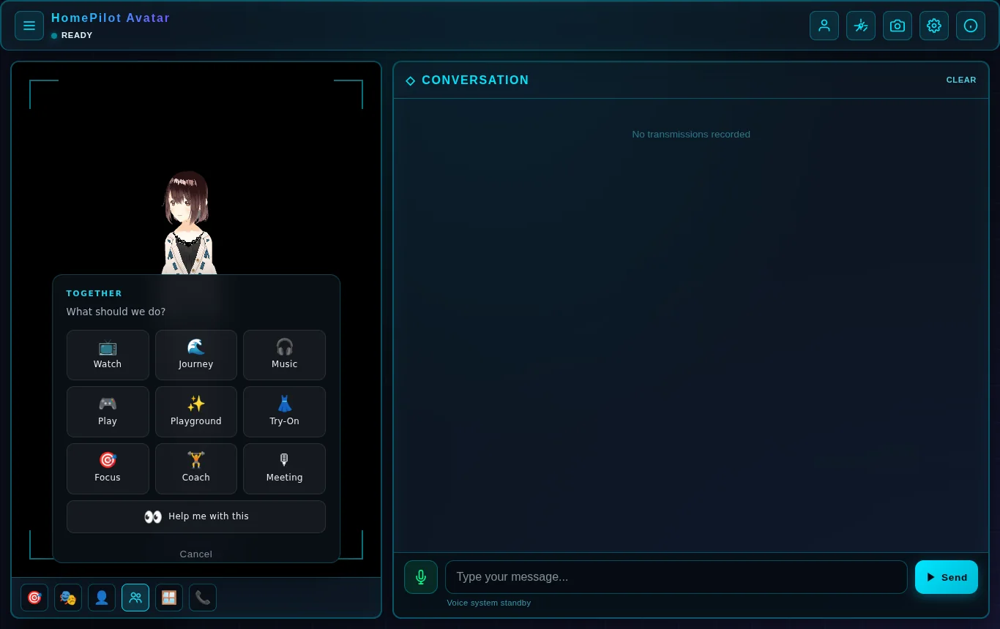
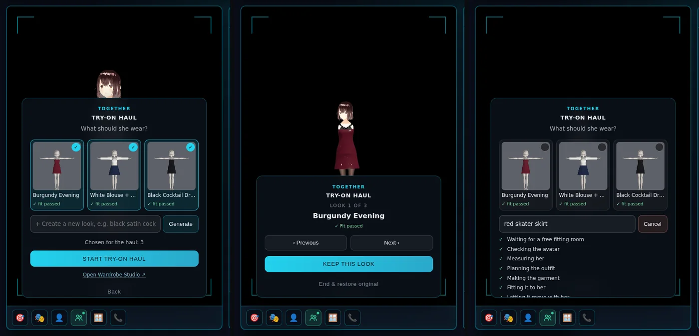
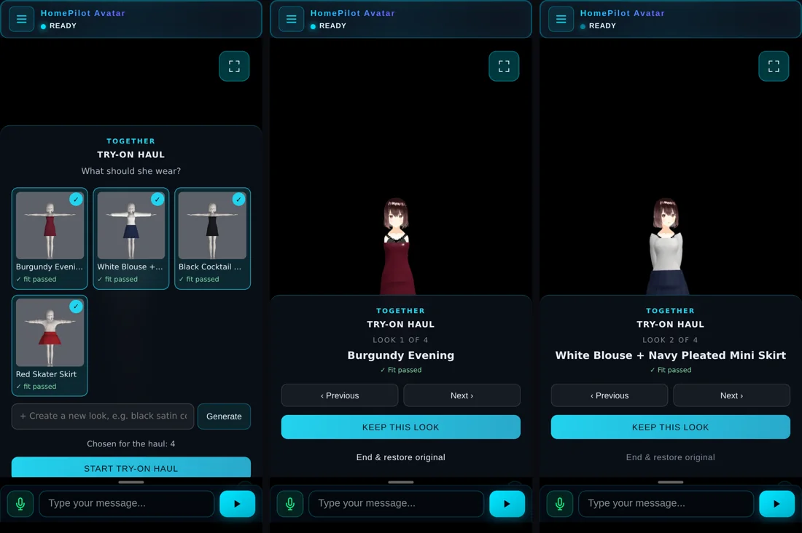

# Try-On inside Together

Try-On is one tile of Together: choose looks (or make one), wear them one at a
time, keep one or go back. It replaces the floating 👗 drawer for everyone who
has Together, and leaves that drawer exactly as it was for everyone who does
not.







Screenshots are from the real app against a local Wardrobe Forge
(`claude/wardrobe-studio-space`), AvatarSample A, three looks made through the
library route and a fourth made from inside Try-On.

## What a person does

1. **Together → 👗 Try-On.** The tile starts Try-On directly; there is no setup
   screen whose only button is "Start".
2. **Choose.** Her looks are cards (picture, name, fit). Tap to choose; the
   order you choose in is the order of the haul.
3. **Create a new look** (when a Forge is configured). Type what she should
   wear; the steps shown are Forge's own job states, ticked as they happen. The
   new look joins the shelf, already chosen. Cancel stops the wait at once.
4. **Start Try-On Haul.** Look 1 goes on. *Previous* / *Next* (or ← →) step
   through; "putting it on…" shows while a VRM loads, and tapping faster than it
   loads lands on the last tap.
5. **Keep this look** ends the haul with her in it. **End & restore original**
   puts her back — to what she wore when the haul began, which is a kept look
   if she kept one earlier.

Escape goes back from the choosing screen and never ends a haul by surprise.
Together's own *Stop* ends it too; either way she is restored exactly once.

## How it is built

Ten new files and one edit (script tags). Nothing in Together, `boot.js`,
`TogetherPanel` or the existing wardrobe modules was changed.

| File                                    | Owns                                                                                                                                     |
| --------------------------------------- | ---------------------------------------------------------------------------------------------------------------------------------------- |
| `src/wardrobe/AvatarIdentity.js`        | Which avatar Forge is asked to dress: a library slug (five pinned avatars, served from `vendor/avatars/`) or an external URL             |
| `src/wardrobe/TryOnReasons.js`          | Forge's job states as labelled steps; every refusal code as a sentence                                                                   |
| `src/wardrobe/ForgeLibraryClient.js`    | Forge's library routes, through `WardrobeClient.request()`; a cancellable job wait                                                       |
| `src/wardrobe/TryOnGenerator.js`        | `create(prompt)`: route choice, library hash check, progress, refusals. Never touches the avatar                                         |
| `src/wardrobe/TryOnSession.js`          | The haul: choose, Previous/Next, Keep, End (idempotent)                                                                                  |
| `src/wardrobe/TryOnPrivate.js`          | What private mode unlocks for her avatar: `off`, `locked` with the reason, or `open` with quick picks                                    |
| `src/wardrobe/TryOnView.js`             | The screens; sits where the Together panel sits and reuses its classes                                                                   |
| `src/wardrobe/TryOnHaulActivity.js`     | The Together activity (native contract, `ui: {Try-On, 👗, 45}`); lists her looks only                                                    |
| `src/wardrobe/TryOnTogetherBridge.js`   | Registers the tile once Together and the wardrobe both exist; then hides the drawer                                                      |
| `index.html`                            | Nine script tags after `WardrobeBootstrap.js` (the wardrobe's own end-of-body pattern)                                                  |

Rules the code keeps, each with a test in `tests/wardrobe/`:

- **`WardrobeController` is still the only thing that swaps her avatar** and
  the only owner of the snapshot. The session paces the haul; the controller
  wears and restores.
- **Identity comes from the original avatar, never the current look.** A look
  is not an avatar Forge knows. A file named like a built-in avatar counts as
  one only when it is served from `vendor/avatars/`, and a running Forge whose
  published SHA-256 differs is refused before a job is made.
- **Her looks only.** A look is a whole avatar file, so a bundle whose
  `avatarId` names another avatar is not offered.
- **No way round the adult gate.** A refusal is shown as Forge's reason in a
  neutral sentence; Together never makes a declaration.

### Why the activity lives in `src/wardrobe/`

Files in Together's activities folder are behaviour-engine modules, loaded only
by `boot.js`'s flag-guarded list — the parity baseline
(`scripts/behavior-parity-baseline.mjs`) and `tests/behavior/composition.test.js`
enforce it. The Try-On activity is the wardrobe's adapter into Together: a
factory, inert until the bridge calls it once Together is running. Loading it
with the wardrobe keeps the engine's rules untouched and the parity check green.

### Load order

The wardrobe service appears when the viewer is ready (`window.NEXUS_WARDROBE`);
Together when the behaviour engine boots (`window.NEXUS_BD.togetherPanel`).
They finish in either order, so the bridge polls for both (every 250 ms, up to
60 s), registers once — `TogetherPanel.register()` repaints the chooser — and
only then adds `nexus-try-on-in-together` to `<body>`, which hides the drawer.

## Private mode

Turning on private mode in Settings (the 18+ confirmation behind
`NEXUS_SPICY.isEnabled()`) adds a **Private** box to Try-On's choosing screen.
It follows the switch live: turn it off in Settings and the box goes away
without reopening Try-On.

What the box offers depends on her avatar, because two separate questions are
asked and each has one owner:

| Question                          | Who answers                                                                                 |
| --------------------------------- | ------------------------------------------------------------------------------------------- |
| Is the person an adult?           | Private mode — this device's adult confirmation                                             |
| Does the avatar depict an adult?  | Wardrobe Forge's operator, per avatar, in `assets/library/policy.json` (`depictsAdult`)     |

- **Avatar declared adult by Forge** → quick picks (lace lingerie, bikini,
  stockings with a suspender belt, satin nightdress, sheer blouse) and any
  private outfit typed into *Create a new look*. Each pick goes through the
  same create path as any other look, with Forge's real steps.
- **Any other avatar** (AvatarSample A/B, an external VRM) → one sentence
  saying why, and no buttons that would only be refused.
- **Forge not configured or unreachable** → a sentence saying so.

Private mode never stands in for the avatar's declaration. Forge checks
`depictsAdult` again on every job whatever the browser sends, so even a
modified page cannot put an undeclared avatar in a private outfit.

## Configuration

```js
window.NEXUS_WARDROBE_CONFIG = {
    apiUrl: 'https://ruslanmv-3d-wardrobe-forge.hf.space', // enables "Create a new look"
    tryOnInTogether: true, // false: no tile, drawer as before
};
```

Without `apiUrl`, Try-On shows the bundled looks and explains that creating
new ones needs Wardrobe Forge. The "Open Wardrobe Studio ↗" link appears when
`apiUrl` is set and her avatar is a library avatar.

A keyed Forge (`WARDROBE_AUTH_MODE=api_key`) needs its asset URLs reachable
without a header, because the VRM loader cannot send one: run the reference
proxy in 3D-Wardrobe-Forge's `deploy/proxy/` and point `apiUrl` at it.

## Not in this change

Automatic cycling (the controller's timed `tryOnHaul()` is untouched and still
available); drawing Try-On inside the Together panel's own box (needs an
optional render hook in `TogetherPanel`); deleting the drawer code.
