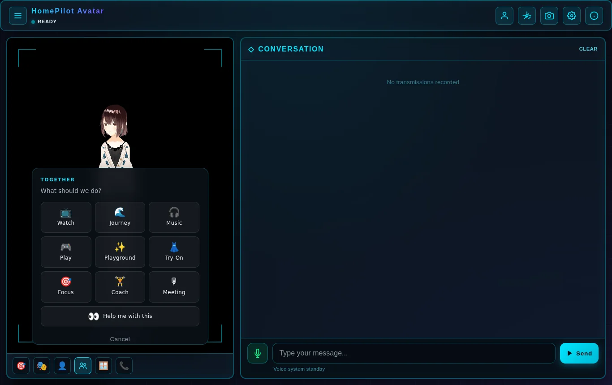
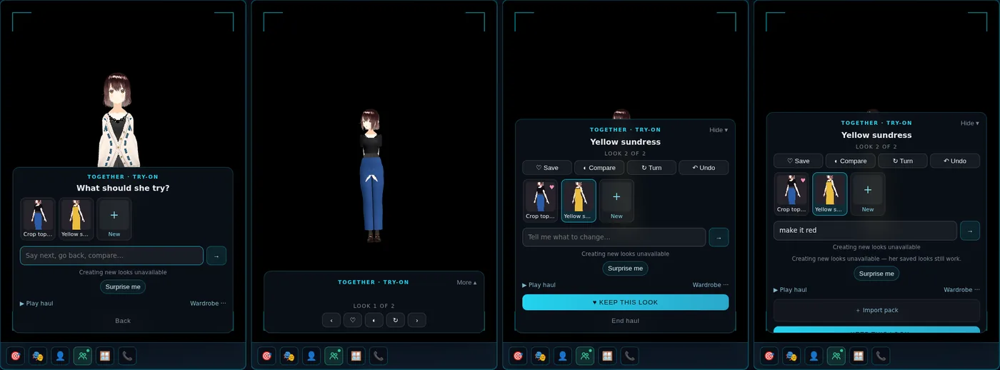
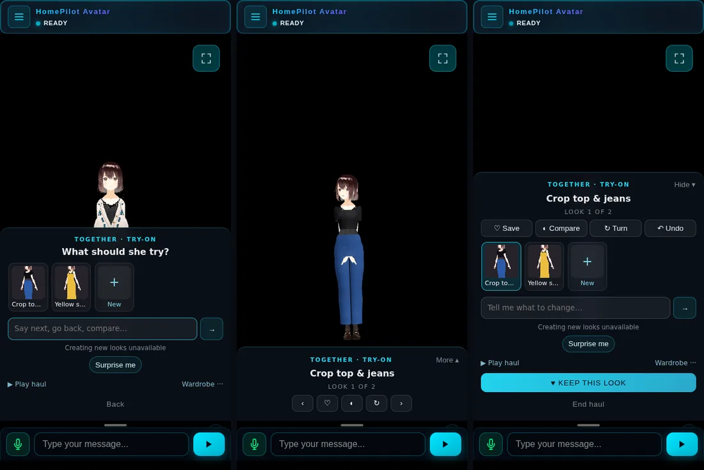

# Try-On inside Together

Try-On is one tile of Together, played live: tap a look and she wears it, ask
for a change and Forge makes it, compare, undo, heart a few, keep one or go
back. It replaces the floating 👗 drawer for everyone who has Together, and
leaves that drawer exactly as it was for everyone who does not.







Screenshots are from the real app with the shipped pack and no Forge
configured (AvatarSample A), which is how it ships: every saved look works and
the composer says, quietly, that creating new looks is unavailable.

## What a person does (LT1–LT2)

W7 was a selection workflow — tick looks, press _Start Try-On Haul_, then
Previous / Next / Keep. LT2 replaces it with one continuous screen, because the
avatar is the show and the wardrobe is only the control surface.

1. **Together → 👗 Try-On** opens straight onto _What should she try?_: her
   looks in a strip, **+ New**, one composer, a few chips, **Surprise me**,
   Back. Nothing about packs or servers.
2. **Tap a look and she wears it.** There is no Start. The haul begins with the
   first look (that is when the controller takes its snapshot), and tapping
   faster than a VRM loads lands on the last tap — the looks in between are
   never loaded and never enter the history.
3. **The reveal.** As a look arrives the name fades in, a soft light passes over
   the avatar card, and the sheet folds to a one-row remote — ‹ ♡ ◐ ↻ › — so
   she is seen whole. **More ▴** opens it again, and after that it stays open
   for the rest of the haul. A request in progress, a question back or a notice
   always opens it.
4. **Change something** by typing or tapping a chip. `TryOnIntent` decides
   whether that is navigation (_next_, _go back to the yellow dress_, _undo_,
   _compare_, _keep this_, _play_) or a request to Forge (_make the top red_,
   _keep the jeans but give her a satin crop top_, _something more elegant_).
   Navigation never reaches Forge. A request shows **DESIGNING · FITTING ·
   READY**, with Forge's eleven real steps under **Details ▾**, and the new look
   is put on as soon as it is made.
5. **Save (♡) is not Keep.** Heart as many as you like; the haul goes on.
   **▶ Play haul** cycles the hearted looks once there are two (else all of
   them) until any other tap. **◐ Compare** shows _Original ↔ Current_ or
   _Previous ↔ Current_ without changing the history; **↶ Undo** walks the
   history back to the original; **↻ Turn** shows her back.
6. **♥ Keep this look** ends the haul with her in it. **End haul** puts her back
   — to what she wore when the haul began, which is a kept look if she kept one
   earlier.

She reacts, sometimes: one line when a look is made for her, when the mood
changes (casual to dressy), or every third wear — never on compare, undo or Show
Mode — with two or three things to tap (_Show me the back_, _Try another
colour_, _Keep this_). The line lives in Try-On for six seconds; it is not a
chat message and never reaches the transcript or the prompt.

Escape ends a compare, closes Wardrobe ···, or — before anything is worn — goes
back. It never ends a haul. ← → step through her looks, and so does a swipe
across the look's name. Together's own _Stop_ ends the haul too; either way she
is restored exactly once.

### "Change X" keeps everything else

The rule the intent layer is built around: **a change preserves whatever the
person did not ask to change.**

- A look Forge made on her library route (`source` `generated` or `forge`) is
  known to Forge by id. The request is only the new garment — `satin crop top`
  — sent with `baseLookId`, and Forge's strip plan replaces only what the new
  garment covers. `ForgeLibraryClient.createJob` already took `baseLookId`;
  `TryOnGenerator.create(prompt, {baseLookId})` now passes it.
- Any other look (the shipped pack, an imported pack, an avatar on the generic
  route) is not on Forge. It is rebuilt from her original avatar with the
  look's own recipe, in which only the named part is rewritten:
  `black fitted crop top + blue straight jeans` → `red fitted crop top + blue
  straight jeans`.
- "Make it red" on a look of two parts asks _Which part?_ with an answer to tap
  for each. "Change the top" with nothing after it asks what the new top should
  be. Asking for what she already has is answered, not sent.

## How it is built

Twelve files and one edit (script tags). Nothing in Together, `boot.js`,
`TogetherPanel` or the wardrobe's original modules was changed.

| File                                    | Owns                                                                                                                                     |
| --------------------------------------- | ---------------------------------------------------------------------------------------------------------------------------------------- |
| `src/wardrobe/AvatarIdentity.js`        | Which avatar Forge is asked to dress: a library slug (five pinned avatars, served from `vendor/avatars/`) or an external URL             |
| `src/wardrobe/TryOnReasons.js`          | Forge's job states as labelled steps, grouped into three stages (LT1); every refusal code as a sentence                                  |
| `src/wardrobe/ForgeLibraryClient.js`    | Forge's library routes, through `WardrobeClient.request()`; a cancellable job wait                                                       |
| `src/wardrobe/TryOnGenerator.js`        | `create(prompt, {baseLookId})`: route choice, library hash check, progress, refusals. Never touches the avatar                           |
| `src/wardrobe/TryOnSession.js`          | The haul (LT1): wear, history and Undo, Compare, favourites, Show Mode, Keep, End (idempotent)                                           |
| `src/wardrobe/TryOnIntent.js`           | What was typed (LT1): a session command, a look she has, or a Forge request — and "change X" keeping the rest. Pure                      |
| `src/wardrobe/TryOnReactions.js`        | Her one-line reactions and when to say nothing (LT1). Pure                                                                               |
| `src/wardrobe/TryOnPrivate.js`          | What private mode unlocks for her avatar: `off`, `locked` with the reason, or `open` with quick picks                                    |
| `src/wardrobe/TryOnView.js`             | The one live screen (LT2); sits where the Together panel sits and reuses its classes                                                     |
| `src/wardrobe/TryOnHaulActivity.js`     | The Together activity (native contract, `ui: {Try-On, 👗, 45}`); lists her looks only; Turn, put back exactly at the end                 |
| `src/wardrobe/TryOnTogetherBridge.js`   | Registers the tile once Together and the wardrobe both exist; then hides the drawer                                                      |
| `index.html`                            | Eleven script tags after `WardrobeBootstrap.js` (the wardrobe's own end-of-body pattern)                                                 |

Rules the code keeps, each with a test in `tests/wardrobe/`:

- **`WardrobeController` is still the only thing that swaps her avatar** and
  the only owner of the snapshot. The session paces the haul; the controller
  wears and restores. `TryOnIntent` and `TryOnReactions` never touch her at
  all, and Turn rotates the loaded model's root — a view of her, not a change
  — and writes the exact yaw back when the haul ends.
- **Identity comes from the original avatar, never the current look.** A look
  is not an avatar Forge knows. A file named like a built-in avatar counts as
  one only when it is served from `vendor/avatars/`, and a running Forge whose
  published SHA-256 differs is refused before a job is made.
- **Her looks only.** A look is a whole avatar file, so a bundle whose
  `avatarId` names another avatar is not offered.
- **No way round the adult gate.** A refusal is shown as Forge's reason in a
  neutral sentence; Together never makes a declaration.

### Why the activity lives in `src/wardrobe/`

Files in Together's activities folder are behaviour-engine modules, loaded only
by `boot.js`'s flag-guarded list — the parity baseline
(`scripts/behavior-parity-baseline.mjs`) and `tests/behavior/composition.test.js`
enforce it. The Try-On activity is the wardrobe's adapter into Together: a
factory, inert until the bridge calls it once Together is running. Loading it
with the wardrobe keeps the engine's rules untouched and the parity check green.

### Load order

The wardrobe service appears when the viewer is ready (`window.NEXUS_WARDROBE`);
Together when the behaviour engine boots (`window.NEXUS_BD.togetherPanel`).
They finish in either order, so the bridge polls for both (every 250 ms, up to
60 s), registers once — `TogetherPanel.register()` repaints the chooser — and
only then adds `nexus-try-on-in-together` to `<body>`, which hides the drawer.

## Private mode

Turning on private mode in Settings (the 18+ confirmation behind
`NEXUS_SPICY.isEnabled()`) adds a **Private** tab beside _For you_, _Casual_
and _Dressy_ (LT2: it used to be a separate pink box, which made it feel like a
second wardrobe). Choosing it changes the suggestions and nothing else. It
follows the switch live: turn it off in Settings and the tab goes away without
reopening Try-On.

What the tab offers depends on her avatar, because two separate questions are
asked and each has one owner:

| Question                          | Who answers                                                                                 |
| --------------------------------- | ------------------------------------------------------------------------------------------- |
| Is the person an adult?           | Private mode — this device's adult confirmation                                             |
| Does the avatar depict an adult?  | Wardrobe Forge's operator, per avatar, in `assets/library/policy.json` (`depictsAdult`)     |

- **Avatar declared adult by Forge** → quick picks (lace lingerie, bikini,
  stockings with a suspender belt, satin nightdress, sheer blouse) and any
  private outfit typed into the composer. Each pick goes through the
  same create path as any other look, with Forge's real steps.
- **Any other avatar** (AvatarSample A/B, an external VRM) → one sentence
  saying why, and no buttons that would only be refused.
- **Forge not configured or unreachable** → a sentence saying so.

Private mode never stands in for the avatar's declaration. Forge checks
`depictsAdult` again on every job whatever the browser sends, so even a
modified page cannot put an undeclared avatar in a private outfit.

## Configuration

```js
window.NEXUS_WARDROBE_CONFIG = {
    apiUrl: 'https://ruslanmv-3d-wardrobe-forge.hf.space', // enables "Create a new look"
    tryOnInTogether: true, // false: no tile, drawer as before
};
```

Without `apiUrl`, Try-On shows the bundled looks, every one fully playable, and
the composer says _Creating new looks unavailable_ underneath. Navigation still
works from the composer. **Wardrobe ···** holds library management — import a
pack, the packs kept in this browser, and "Open Wardrobe Studio ↗", which
appears when `apiUrl` is set and her avatar is a library avatar.

A keyed Forge (`WARDROBE_AUTH_MODE=api_key`) needs its asset URLs reachable
without a header, because the VRM loader cannot send one: run the reference
proxy in 3D-Wardrobe-Forge's `deploy/proxy/` and point `apiUrl` at it.

## Not in this change

Drawing Try-On inside the Together panel's own box (needs an optional render
hook in `TogetherPanel`); deleting the drawer code; a split-screen compare
(compare swaps the VRM, so it is a toggle, not a side-by-side); reactions spoken
aloud. The controller's timed `tryOnHaul()` is untouched; Show Mode is the
session's own, paced by the person's taps.
