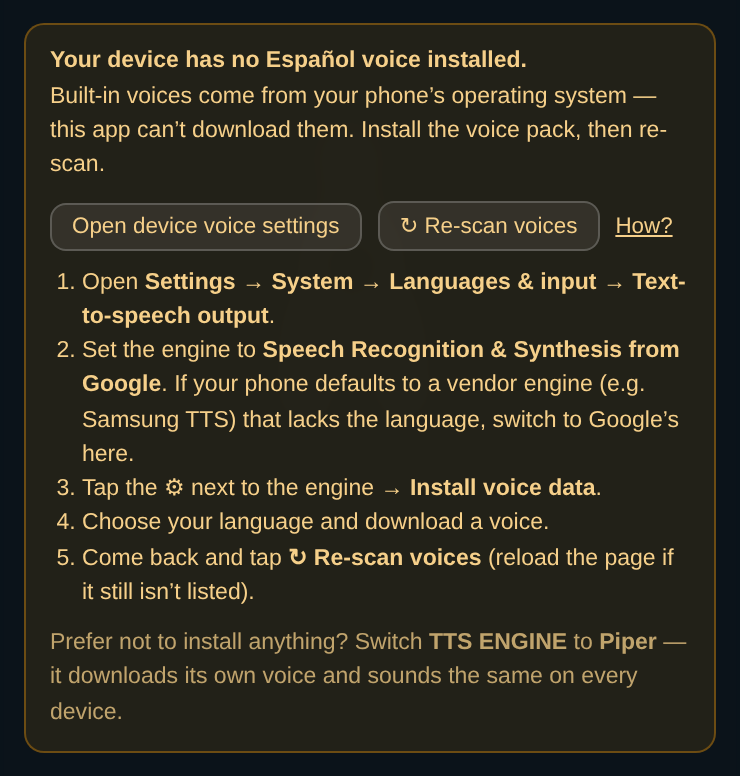

# Voices — where they come from and how to get more

If the avatar won't speak your language, this page tells you why and what to do.
The short version: **built-in voices belong to your device, not to this app.**

## Architecture truth (read this first)

The **Built-in TTS engine is the browser's Web Speech API (`speechSynthesis`)** — a
thin bridge to the **operating system's** text-to-speech. This app ships no models on
that path and **cannot download any**. It only enumerates whatever voices the device
offers and picks one matching your language + gender preference.

So a "missing" language is never a bug in the app's voice list. The voice pack isn't
installed on the device, and only you can install it.

| Platform | Who supplies the voices |
| --- | --- |
| **Android (Chrome)** | Google *Speech Recognition & Synthesis* — per-language downloadable neural voice packs. Samsung devices may default to **Samsung TTS** instead, which carries fewer languages. |
| **Windows (Chrome)** | Microsoft SAPI voices (David, Zira, Helena/Sabina…). **Edge** additionally exposes the "Microsoft … Online (Natural)" Azure neural voices — the best quality on Windows. |
| **macOS / iOS (Safari)** | Apple voices (Samantha, Mónica, Paulina; Siri-grade ones once downloaded in system settings). |
| **Linux** | Typically eSpeak — robotic but always present. |

**Piper is the opposite.** It's the one engine where *we* choose the models: ONNX
files from Hugging Face, downloaded once and cached in the browser. Identical voice on
every device, upgradeable from our catalog, no system install.

| | Built-in (Web Speech API) | Piper (WASM) |
| --- | --- | --- |
| Where voices come from | Your OS | Our catalog, cached in-browser |
| Consistent across devices | ✖ varies by phone/PC | ✔ identical everywhere |
| Install needed | Sometimes (per language) | None — first use downloads ~60 MB |
| Startup | Instant | First sentence waits for the model |
| Offline | ✔ | ✔ after the first download |
| Language coverage | Whatever the device has | Fixed set — see [TTS.md](TTS.md) |
| Female Spanish / German / Portuguese | ✔ usually | **✖ none exist that this runtime can play** |

That last row is the practical one: for a **female Spanish, German or Portuguese**
voice you want the **built-in** engine. See [TTS.md](TTS.md) for why Piper has none.

## In-app help

Settings ▸ **SPEECH** shows a notice whenever the built-in engine is selected and your
device has no voice for the current language. It offers the shortcut below on Android,
the manual steps everywhere, and a **↻ Re-scan voices** action so you can confirm the
install without hunting for a reload.

## Installing a voice

### Android

The notice's **Open device voice settings** button jumps straight to the system TTS
screen. A few OEM skins block that, in which case the manual steps appear automatically:

1. **Settings → System → Languages & input → Text-to-speech output**
2. Set the engine to **Speech Recognition & Synthesis from Google**.
   If your phone defaults to a vendor engine (e.g. Samsung TTS) that lacks the
   language, switch to Google's here.
3. Tap the ⚙ next to the engine → **Install voice data**
4. Choose your language and download a voice
5. Back in the app, tap **↻ Re-scan voices** (reload the page if it still isn't listed)

### iPhone / iPad

**There is no deep link.** Apple blocks web pages from opening Settings, so the app
shows the path rather than a button that wouldn't work:

1. **Settings → Accessibility → Spoken Content → Voices**
2. Pick your language, then download a voice
3. **Relaunch Safari** — new voices only become visible to web pages after a relaunch
4. Back in the app, tap **↻ Re-scan voices**

### Windows

1. **Settings → Time & Language → Speech** → **Add voices**
2. Install the language, then restart the browser
3. For the best quality use **Microsoft Edge**, which also exposes the
   "Microsoft … Online (Natural)" neural voices

### macOS

**System Settings → Accessibility → Spoken Content → System Voice → Manage Voices**,
download a voice for your language, then restart the browser.

## Verifying

Open [`tests/tts-language-matrix.html`](../tests/tts-language-matrix.html) — a grid of
every language × (built-in, Piper) × (female, male). Each cell names the voice the app
would actually pick on **this** device (e.g. "Google español", "Microsoft Helena") and
plays a sentence *in that language*, so a wrong-language voice is instantly audible.

Because built-in voices are device-supplied, the built-in columns legitimately differ
between your phone and your desktop — that comparison is the point. The Piper columns
should be identical everywhere; if they aren't, run
`node tests/piper-catalog-audit.mjs`.
